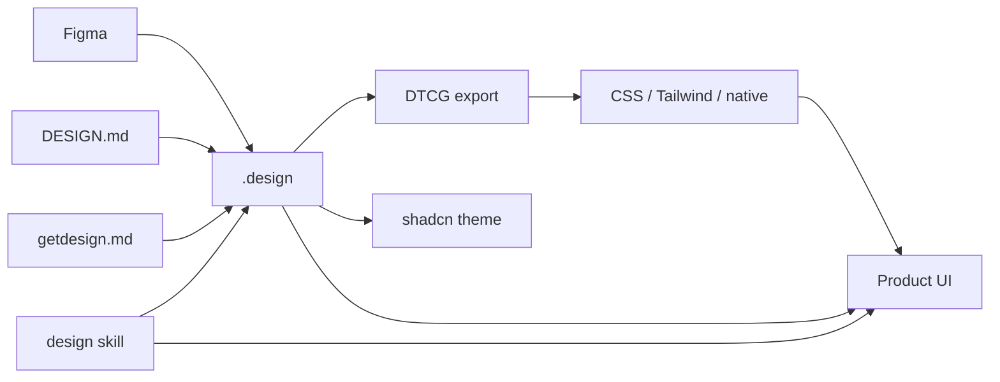
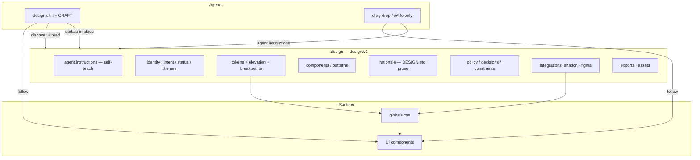

# `.design` — Living Visual Contract for AI Design

[](LICENSE)
[](SPEC.md)
[](https://skills.sh/AgentsORG/DESIGN)
[](https://github.com/AgentsORG/DESIGN/releases)

**A self-contained visual contract you can drop into any repo — or drag into any agent.**  
YAML file + portable skill. Agents read it, follow it, and update it as design progresses. No skill install required for basic use: every file carries its own `agent.instructions`.

Maintained by [AgentsORG](https://www.agents.org.in/) · Spec: [SPEC.md](SPEC.md) · Docs: [docs/INDEX.md](docs/INDEX.md)

```bash
npx skills add AgentsORG/DESIGN --skill design
cp templates/starter.design ./.design   # annotated blank slate — every section explained
# or start from a brand analysis: cp examples/vercel.design ./.design
# or: drag any *.design into your agent — it teaches itself via agent.instructions
```

## About

`.design` is the **OpenAPI of product UI**: one machine-readable file that is also human-auditable in git. It unifies what agents otherwise invent session-to-session — tokens, components, taste rationale, and decision rules — into a living contract.

| Problem | What `.design` does |
| --- | --- |
| Agents invent off-brand hex and rebuild Button | Normative `tokens` + `components` with when/when_not |
| Every generated page looks like every other AI page | `intent.direction` + `signature` + default-looks-to-avoid craft catalogue |
| Style guides go stale | Edit the file in place; git is history |
| DESIGN.md prose lost on import | Full `rationale.*` + property bags |
| Copy tone drifts per session | `voice` — the UI copy contract |
| Skill not installed | Required `agent.instructions` — drag-drop still works |
| shadcn / Figma / DTCG drift | `integrations` + `exports` + `themes` |

Imports [Google DESIGN.md](https://github.com/google-labs-code/design.md) losslessly. Orchestrates [shadcn/ui](https://ui.shadcn.com/). Bootstraps from [getdesign.md](https://getdesign.md/). Works with every [skills.sh](https://www.skills.sh/agent/) agent.

## Ecosystem



Full map: [docs/ecosystem.md](docs/ecosystem.md) · Self-contained drop-in: [docs/self-contained.md](docs/self-contained.md).

## Architecture



## Quick start

### 1. Drop a file in your repo

```bash
cp templates/starter.design ./.design
```

[templates/starter.design](templates/starter.design) is a fully annotated kitchen-sink contract — copy, replace values, delete what you don't need. Or start from a converted brand analysis in [examples/](examples/) (independent analyses — **not affiliated** with those brands, [NOTICE.md](NOTICE.md)). Every file includes full `agent.instructions`.

### 2. Point agents at it (or drag the file)

Add to `AGENTS.md`:

```markdown
## Design
Before UI work, read `./.design` (or activate the `design` skill).
Obey `agent.instructions` in that file. Ask before changing `locked` paths.
```

### 3. Optional — install the skill (enriched CRAFT + review)

```bash
npx skills add AgentsORG/DESIGN --skill design
```

### 4. Optional — shadcn / Figma / exports

See [docs/shadcn.md](docs/shadcn.md), [docs/ecosystem.md](docs/ecosystem.md), and SPEC §7.2–§7.5.

## What’s in a `.design` file

| Layer | Contents |
| --- | --- |
| **Agent** | `agent.instructions` (required) — self-teach on drop-in |
| **Identity** | `name`, `version`, `status`, `overview`, `intent` (direction, signature, treatment), `themes` |
| **System** | `tokens` (nestable groups), `components`, `patterns`, `locked`, `assets` |
| **Voice** | UI copy contract — register, casing, terminology, error style |
| **Rationale** | DESIGN.md body prose (`rationale.*`) |
| **Rules** | `policy`, `decisions`, `constraints`, `examples` |
| **Integrations** | `shadcn` (styles, bases, registries, MCP), `figma` |
| **Exports** | DTCG, CSS, Tailwind, shadcn registry item, Style Dictionary, native |

Lifecycle: `bootstrap` → `refine` → `lock` → `evolve`. History lives in **git**.

## Documentation

| Doc | Topic |
| --- | --- |
| [docs/INDEX.md](docs/INDEX.md) | Full docs hub |
| [docs/self-contained.md](docs/self-contained.md) | In-file agent instructions |
| [docs/overview.md](docs/overview.md) | System map + diagrams |
| [docs/ecosystem.md](docs/ecosystem.md) | Figma → DTCG → CSS / agents |
| [docs/design-md-mapping.md](docs/design-md-mapping.md) | DESIGN.md field parity |
| [docs/shadcn.md](docs/shadcn.md) | shadcn/ui integration |
| [docs/getdesign.md](docs/getdesign.md) | getdesign.md pipeline |
| [SPEC.md](SPEC.md) | Normative design.v1 |

## Examples

| File | Reference |
| --- | --- |
| [vercel.design](examples/vercel.design) | getdesign.md/vercel |
| [stripe.design](examples/stripe.design) | getdesign.md/stripe |
| [notion.design](examples/notion.design) | getdesign.md/notion |
| [apple.design](examples/apple.design) | getdesign.md/apple |
| [linear.design](examples/linear.design) | getdesign.md/linear.app |
| [supabase.design](examples/supabase.design) | getdesign.md/supabase |

## Contributing

See [CONTRIBUTING.md](CONTRIBUTING.md) and [CODE_OF_CONDUCT.md](CODE_OF_CONDUCT.md). Security: [SECURITY.md](SECURITY.md).

## Status

**design.v1** — released; current contract **1.2** ([CHANGELOG](CHANGELOG.md)): voice, committed intent (direction / signature / treatment), nested tokens, current shadcn model + registry export, annotated starter template, and reference tooling — [lint](scripts/lint_design.py), [export](scripts/export_design.py) (CSS / Tailwind v4 / DTCG / shadcn registry item), [diff](scripts/diff_design.py) with §18 regression flag — all CI-enforced. Standalone packaged CLI planned.

## License

[MIT](LICENSE) © AgentsORG
