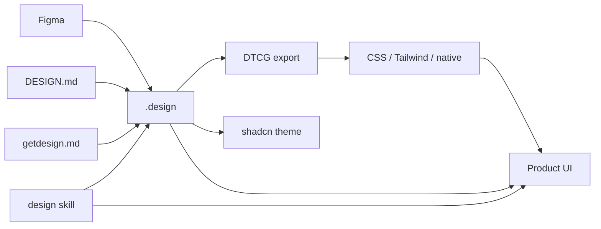
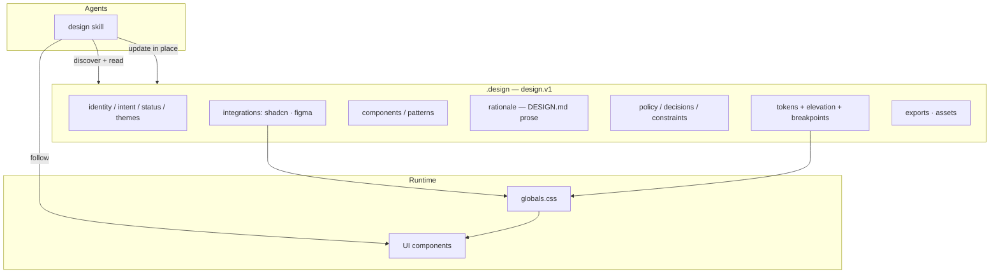

# `.design` — Living Visual Contract for AI Design

[](LICENSE)
[](SPEC.md)
[](skills/design/)

**OpenAPI for product UI.** A single YAML file you drop into any repository. Agents **read** it before generating UI, **follow** it as the normative contract, and **update** it in place as design progresses.

Maintained by [AgentsORG](https://www.agents.org.in/) · Spec: [SPEC.md](SPEC.md) · Docs: [docs/INDEX.md](docs/INDEX.md) · Philosophy: [PHILOSOPHY.md](PHILOSOPHY.md)

```bash
npx skills add AgentsORG/DESIGN --skill design
cp examples/vercel.design ./.design
```

## Why

AI agents invent tokens, drift between sessions, and rebuild components you already have. A static style guide goes stale. `.design` is a **living contract in git** plus a portable **Agent Skill** so every [skills.sh](https://www.skills.sh/agent/) agent shares one procedure: discover → read → follow → update → verify.

It is a **superset** of [Google DESIGN.md](https://github.com/google-labs-code/design.md), orchestrates [shadcn/ui](https://ui.shadcn.com/), bridges Figma → DTCG → CSS/Tailwind, and bootstraps from [getdesign.md](https://getdesign.md/) analyses.

## Ecosystem



Full map: [docs/ecosystem.md](docs/ecosystem.md).

## Architecture



## Quick start

### 1. Drop a file in your repo

```bash
cp examples/vercel.design ./.design
```

Examples are independent visual analyses — **not affiliated** with those brands ([NOTICE.md](NOTICE.md)). Adapt to your product.

### 2. Point agents at it

```markdown
## Design
Before UI work, activate the `design` skill and read `./.design`.
Follow tokens, components, rationale, and constraints.
If `integrations.shadcn` is enabled, apply CSS vars and prefer shadcn components.
Ask before changing `locked` paths.
```

### 3. Install the skill

```bash
npx skills add AgentsORG/DESIGN --skill design
```

### 4. Optional — shadcn / Figma / exports

See [docs/shadcn.md](docs/shadcn.md), [docs/ecosystem.md](docs/ecosystem.md), and SPEC §7.2–§7.5.

## What’s in a `.design` file

| Layer | Contents |
| --- | --- |
| **Identity** | `name`, `version`, `status`, `overview`, `intent`, `themes` |
| **System** | `tokens`, `components`, `patterns`, `locked`, `assets` |
| **Rationale** | DESIGN.md body prose (`rationale.*`) |
| **Rules** | `policy`, `decisions`, `constraints`, `examples` |
| **Integrations** | `shadcn`, `figma` |
| **Exports** | DTCG, CSS, Tailwind, Style Dictionary, native |

Lifecycle: `bootstrap` → `refine` → `lock` → `evolve`. History lives in **git**.

## Documentation

| Doc | Topic |
| --- | --- |
| [docs/INDEX.md](docs/INDEX.md) | Full docs hub |
| [docs/overview.md](docs/overview.md) | System map + diagrams |
| [docs/ecosystem.md](docs/ecosystem.md) | Figma → DTCG → CSS / agents |
| [docs/design-md-mapping.md](docs/design-md-mapping.md) | DESIGN.md field parity |
| [docs/shadcn.md](docs/shadcn.md) | shadcn/ui integration |
| [docs/getdesign.md](docs/getdesign.md) | getdesign.md pipeline |
| [docs/drop-in.md](docs/drop-in.md) | Install in any repo |
| [docs/agent-consumption.md](docs/agent-consumption.md) | Agent loop |
| [docs/human-authoring.md](docs/human-authoring.md) | Authoring guide |
| [docs/lifecycle.md](docs/lifecycle.md) | Status + locked |
| [docs/comparison.md](docs/comparison.md) | vs adjacent formats |
| [SPEC.md](SPEC.md) | Normative design.v1 |

## Examples

| File | Reference |
| --- | --- |
| [vercel.design](examples/vercel.design) | getdesign.md/vercel |
| [stripe.design](examples/stripe.design) | getdesign.md/stripe |
| [notion.design](examples/notion.design) | getdesign.md/notion |
| [apple.design](examples/apple.design) | getdesign.md/apple |
| [linear.design](examples/linear.design) | getdesign.md/linear.app |
| [supabase.design](examples/supabase.design) | getdesign.md/supabase |

## Repository layout

```
SPEC.md                 # Normative design.v1
PHILOSOPHY.md
schema/design.v1.schema.json
skills/design/          # Agent Skill (agentskills.io)
examples/               # getdesign.md-sourced systems
docs/                   # Guides + Mermaid diagrams
scripts/convert_getdesign.py
```

## Contributing

See [CONTRIBUTING.md](CONTRIBUTING.md) and [CODE_OF_CONDUCT.md](CODE_OF_CONDUCT.md). Security: [SECURITY.md](SECURITY.md).

## Status

**design.v1** — format, schema, skill, integrations, examples, docs. CLI (`lint`, `diff`, `verify`, `export`) planned.

## License

[MIT](LICENSE) © AgentsORG
