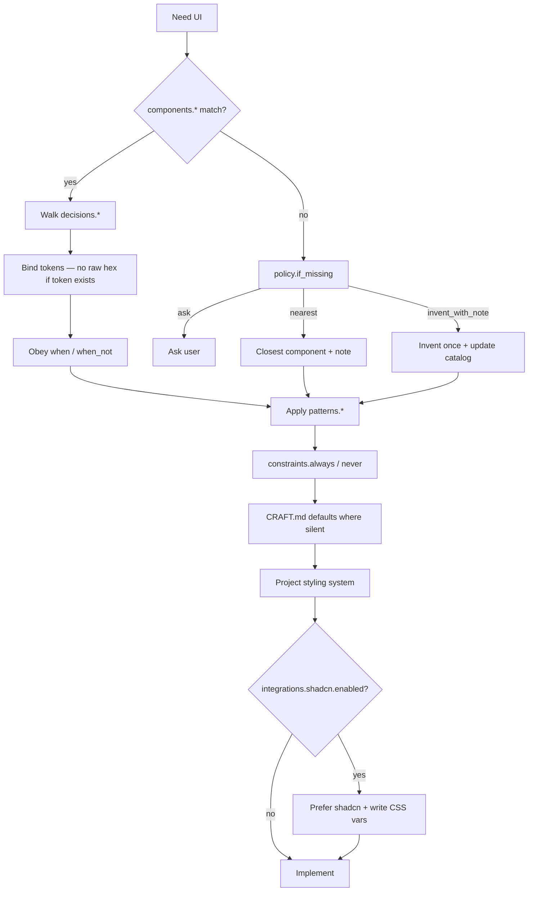

# Agent consumption

How coding agents should discover, read, follow, update, and verify a `.design` file.

Portable procedure: [skills/design/SKILL.md](../skills/design/SKILL.md).

## Activation

Activate when:

- UI generation, restyle, design review, or brand consistency is requested  
- A `.design` / `*.design` file exists  
- User asks to bootstrap, remix, sync, lock, unlock, or verify design  

## Discover → Read → Follow → Update → Verify

## Load order

1. `agent.instructions`  
2. `overview` / `intent` (including `direction`, `signature`, `treatment`)  
3. `constraints`  
4. `policy` / `decisions`  
5. `tokens`  
6. `voice`  
7. `rationale` (on demand for the task at hand)  
8. `components` / `patterns`  
9. `integrations` (e.g. shadcn)  
10. `examples`  
11. `locked` when updating  

### Reading tiers (large files)

For files too large to load comfortably in one pass, read in tiers ([SPEC.md §8.1](../SPEC.md)):

| Tier | Sections | When |
| --- | --- | --- |
| Normative core | `schema`, `agent`, `intent`, `constraints`, `policy`, `decisions`, `tokens`, `components`, `locked`, `themes`, `voice` | MUST load before generating UI |
| Judgment | `overview`, `rationale.*`, `patterns`, `examples` | SHOULD load; defer sections irrelevant to the task |
| Tooling | `integrations`, `exports`, `assets`, `sources`, `provenance` | Load when performing that operation |

## Bootstrap (no file yet)

If UI work is requested and no `.design` exists, offer to bootstrap — do not invent an untracked system. Before proposing anything, scan **adjacent design signals**: design notes in `AGENTS.md` / `CLAUDE.md`, an existing `DESIGN.md`, `globals.css` / theme files, Tailwind config, `components.json`, Storybook. Extract the full visual vocabulary — density, elevation language, motion character, copy tone — not just hex values, and record what was scanned in `sources`. Bootstrap follows the **plan → critique → confirm → write** process ([lifecycle.md](lifecycle.md)).

## Follow (generate UI)

Before walking the tree, calibrate **treatment** for the surface: `patterns.<name>.treatment` > `intent.treatment` > request type (internal tool / dashboard → `utilitarian`; landing / marketing → `editorial`). Utilitarian surfaces get restrained product craft; only editorial surfaces run the distinctive-identity register. Concentrate boldness in `intent.signature`; keep everything around it quiet.

After Follow, agents apply [skills/design/references/CRAFT.md](../skills/design/references/CRAFT.md) for hierarchy, surfaces, motion, and a11y **only where `.design` does not already decide**. Detailed trees: [skills/design/references/APPLY.md](../skills/design/references/APPLY.md).

**Voice:** apply `voice.*` to all UI copy with the same force as tokens ([SPEC.md §13C](../SPEC.md)) — the `register`, `casing` default, `terminology` map (end-user vocabulary, never system terms), `action_naming` continuity, and the `errors` style rule.

### Post-generation self-check

Before finishing any UI task, check and report inline:

- Every `constraints.never` item absent; `constraints.always` items present  
- One primary emphasis per view; boldness only in `intent.signature`  
- No raw hex/spacing/radius where a token exists  
- Both theme modes legible (or `themes.single` declared)  
- No catalogued default look (CRAFT "Default looks to avoid") claimed by accident  

## Update

Edit YAML in place. Bump `version` and `provenance.last_reviewed` when meaningful.

| Situation | Action |
| --- | --- |
| Path in `locked` | Ask first |
| New approved pattern | Add under `patterns` / `components` |
| Token rename | MAJOR if consumers break |
| Sync from Figma / Claude Design | Merge; ask before overwriting locked keys |

**Never** add `proposed_changes` or in-file changelogs.

## Verify

1. Compare `tokens` ↔ CSS variables / Tailwind theme / token files  
2. Compare `integrations.shadcn.css_vars` ↔ `globals.css`  
3. Compare `components` ↔ real imports  
4. Flag hardcoded values that should be tokens  
5. Report per token group as **added / removed / modified**, with a **regression** flag when anything consumers may rely on was removed or changed; update `.design` only when asked  

Checklist: [skills/design/references/REVIEW.md](../skills/design/references/REVIEW.md).

## Precedence

1. Explicit user prompt (this task)  
2. Nearest `.design`  
3. `design` skill  
4. Generic taste skills  
5. Model defaults  

## Citing work

After generating UI, cite:

- Token paths used (`tokens.color.primary`, …)  
- Component catalog keys  
- Whether shadcn CSS vars were written/updated  
