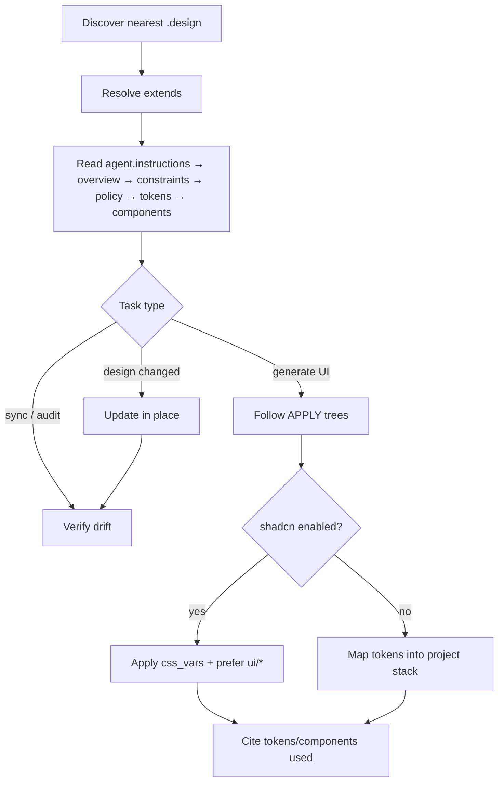
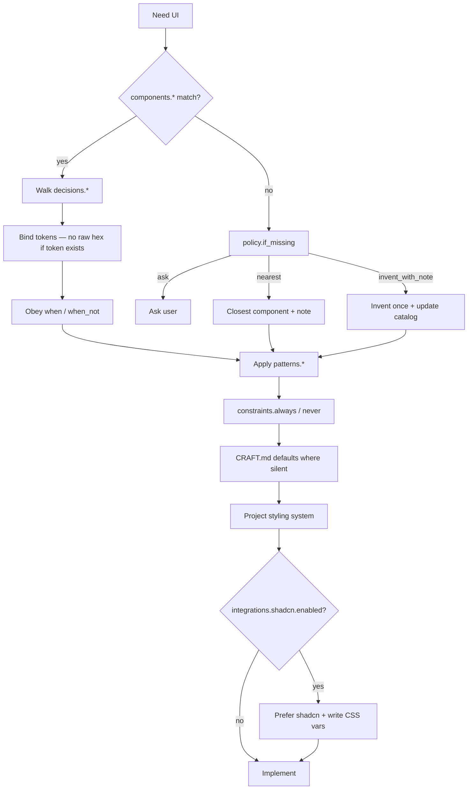

# Agent consumption

How coding agents should discover, read, follow, update, and verify a `.design` file.

Portable procedure: [skills/design/SKILL.md](../skills/design/SKILL.md).

## Activation

Activate when:

- UI generation, restyle, design review, or brand consistency is requested  
- A `.design` / `*.design` file exists  
- User asks to bootstrap, remix, sync, lock, unlock, or verify design  

## Discover → Read → Follow → Update → Verify

## Load order

1. `agent.instructions`  
2. `overview` / `intent`  
3. `constraints`  
4. `policy` / `decisions`  
5. `tokens`  
6. `components` / `patterns`  
7. `integrations` (e.g. shadcn)  
8. `examples`  
9. `locked` when updating  

## Follow (generate UI)

After Follow, agents apply [skills/design/references/CRAFT.md](../skills/design/references/CRAFT.md) for hierarchy, surfaces, motion, and a11y **only where `.design` does not already decide**. Detailed trees: [skills/design/references/APPLY.md](../skills/design/references/APPLY.md).

## Update

Edit YAML in place. Bump `version` and `provenance.last_reviewed` when meaningful.

| Situation | Action |
| --- | --- |
| Path in `locked` | Ask first |
| New approved pattern | Add under `patterns` / `components` |
| Token rename | MAJOR if consumers break |
| Sync from Figma / Claude Design | Merge; ask before overwriting locked keys |

**Never** add `proposed_changes` or in-file changelogs.

## Verify

1. Compare `tokens` ↔ CSS variables / Tailwind theme / token files  
2. Compare `integrations.shadcn.css_vars` ↔ `globals.css`  
3. Compare `components` ↔ real imports  
4. Flag hardcoded values that should be tokens  
5. Report; update `.design` only when asked  

Checklist: [skills/design/references/REVIEW.md](../skills/design/references/REVIEW.md).

## Precedence

1. Explicit user prompt (this task)  
2. Nearest `.design`  
3. `design` skill  
4. Generic taste skills  
5. Model defaults  

## Citing work

After generating UI, cite:

- Token paths used (`tokens.color.primary`, …)  
- Component catalog keys  
- Whether shadcn CSS vars were written/updated  
