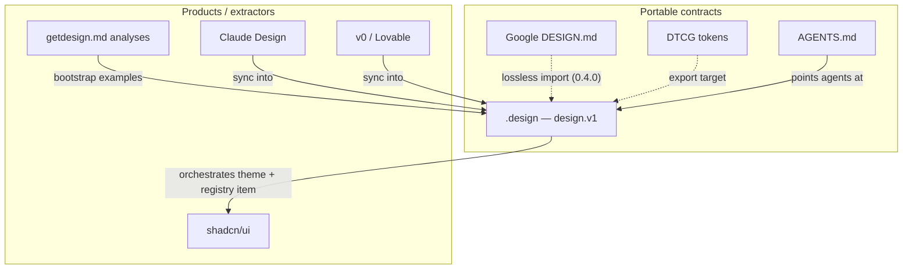

# Comparison

How `.design` relates to adjacent formats and products.

| Format / product | Role vs `.design` |
| --- | --- |
| [Google DESIGN.md](https://github.com/google-labs-code/design.md) | Complementary MD+YAML identity doc, now with its own CLI. `.design` is its own format that imports DESIGN.md **losslessly** — complete mapping, verified against DESIGN.md 0.4.0 — and adds policy, lifecycle, voice, treatment, and shadcn orchestration. Field map: [design-md-mapping.md](design-md-mapping.md) |
| [DTCG](https://www.designtokens.org/) | Token exchange format — export `tokens.*`; do not replace the living contract |
| [AGENTS.md](https://agents.md/) | Repo behavior — point it at `.design` for UI work |
| [getdesign.md](https://getdesign.md/) | Brand DESIGN.md analyses — great bootstrap source → convert to `.design` |
| [shadcn/ui](https://ui.shadcn.com/) | Component + theme runtime — current model: styles (`vega`, `nova`, … ; `new-york` legacy), primitive `base` choice (`base` \| `radix` \| `react-aria`), namespaced registries, MCP server. Orchestrated via `integrations.shadcn`; a distributable theme ships via `exports.shadcn_registry` (`registry:theme` item) |
| Claude Design / Stitch / Figma | Extraction UIs — merge results into repo-canonical `.design` |
| skills.sh Agent Skills | Procedure layer — `skills/design` teaches READ/FOLLOW/UPDATE/VERIFY |

## When to use what

| Need | Use |
| --- | --- |
| Normative UI contract in git | `.design` |
| Cross-tool token interchange | Export DTCG from `tokens` |
| Agent repo instructions | `AGENTS.md` → `.design` |
| Taste inspiration from a public brand | getdesign.md → example → adapt |
| React/Tailwind primitives | shadcn + `integrations.shadcn` |
| Enforceable UI copy rules (register, casing, terminology, error style) | `voice` — applied with token force |
| Marketing boldness vs product restraint per surface | `intent.treatment` + `patterns.<name>.treatment` overrides |
| Distribute the theme to other shadcn projects | `exports.shadcn_registry` (`registry:theme` item, installable via shadcn CLI) |

## What `.design` deliberately is not

- Not a Figma file  
- Not a component library binary  
- Not an in-file RFCs/history store (use git)  
- Not a replacement for accessibility law or product copy decks  
