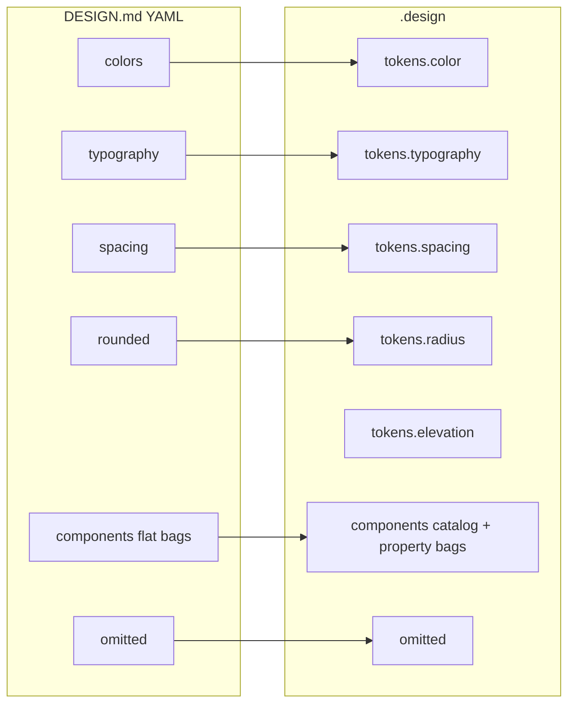

# DESIGN.md ↔ `.design` mapping

`.design` (design.v1) is a **superset** of [Google DESIGN.md](https://github.com/google-labs-code/design.md/blob/main/docs/spec.md). Everything an agent needs from a DESIGN.md (frontmatter tokens + body rationale) maps into the living contract so nothing is lost while designing.

getdesign.md analyses follow the same DESIGN.md shape; examples in this repo are converted losslessly via `scripts/convert_getdesign.py`.

## Frontmatter → tokens / components



| DESIGN.md | `.design` | Notes |
| --- | --- | --- |
| `version` / `name` / `description` | `schema` + `name` + `description` | `schema` is always `design.v1` |
| `colors.*` | `tokens.color.*` | Same CSS color values |
| `typography.*` | `tokens.typography.*` | Includes `fontFeature` / `fontVariation` |
| `spacing.*` | `tokens.spacing.*` | Unitless numbers allowed |
| `rounded.*` | `tokens.radius.*` | Rename only |
| `components.<id>.*` | `components` | See component encoding below |
| `omitted` | `omitted` | Same semantics |
| `{colors.x}` refs | `{tokens.color.x}` | Auto-rewritten on import |

## Body sections → rationale / constraints

| DESIGN.md `##` section | `.design` field |
| --- | --- |
| Overview / Brand & Style | `overview` + `rationale.overview` |
| Colors | `rationale.colors` |
| Typography | `rationale.typography` |
| Layout / Layout & Spacing | `rationale.layout` |
| Elevation & Depth | `rationale.elevation` (+ optional `tokens.elevation`) |
| Shapes | `rationale.shapes` |
| Components (prose) | `rationale.components` |
| Responsive / Iteration / Known Gaps | `rationale.responsive` / `iteration` / `known_gaps` |
| Other `##` headings | `rationale.<slug>` (never drop) |
## Components (critical)

DESIGN.md stores **flat** sibling keys with a fixed property whitelist:

```yaml
# DESIGN.md
components:
  button-primary:
    backgroundColor: "{colors.primary}"
    textColor: "{colors.on-primary}"
    typography: "{typography.body}"
    rounded: "{rounded.pill}"
    padding: 11px 22px
  button-primary-hover:
    backgroundColor: "{colors.primary-focus}"
```

`.design` accepts that form **and** a catalog form with usage rules:

```yaml
# .design catalog form
components:
  button:
    when: ["primary actions"]
    when_not: ["nav links"]
    variants: [button-primary, button-primary-hover]
    tokens:
      button-primary:
        backgroundColor: "{tokens.color.primary}"
        textColor: "{tokens.color.on-primary}"
        typography: "{tokens.typography.body}"
        rounded: "{tokens.radius.pill}"
        padding: "11px 22px"
      button-primary-hover:
        backgroundColor: "{tokens.color.primary-focus}"
```

### Property whitelist (must not be dropped)

| Property | Required support |
| --- | --- |
| `backgroundColor` | yes (alias `background`) |
| `textColor` | yes (alias `foreground`) |
| `typography` | yes |
| `rounded` | yes (alias `radius`) |
| `padding` | yes |
| `size` / `height` / `width` | yes |
| Unknown props | accept + warn (DESIGN.md consumer rule) |

Agents MUST bind every listed property when implementing a component — approximate restyles are a format violation.

## What `.design` adds (beyond DESIGN.md)

| Addition | Why |
| --- | --- |
| `intent`, `policy`, `decisions`, `patterns` | Agent decision procedures |
| `locked`, `status`, SemVer `version` | Lifecycle / ask-before-edit |
| `integrations.shadcn` | Theme → CSS variables / components.json |
| `agent.instructions` | Drop-in procedure stub |
| `when` / `when_not` | Stop inventing duplicate controls |

## Import checklist (human or agent)

When converting a DESIGN.md / getdesign analysis:

1. [ ] All color / type / spacing / rounded tokens copied  
2. [ ] Every component key + every property retained  
3. [ ] Hover/active/focus sibling keys retained  
4. [ ] All eight body sections landed in `rationale` (or `omitted` with reason)  
5. [ ] Do’s/Don’ts mirrored into `constraints`  
6. [ ] Token references rewritten to `tokens.*`  
7. [ ] Provenance / sources cite the DESIGN.md URL  

Normative detail: [SPEC.md §11–§13B](../SPEC.md).
