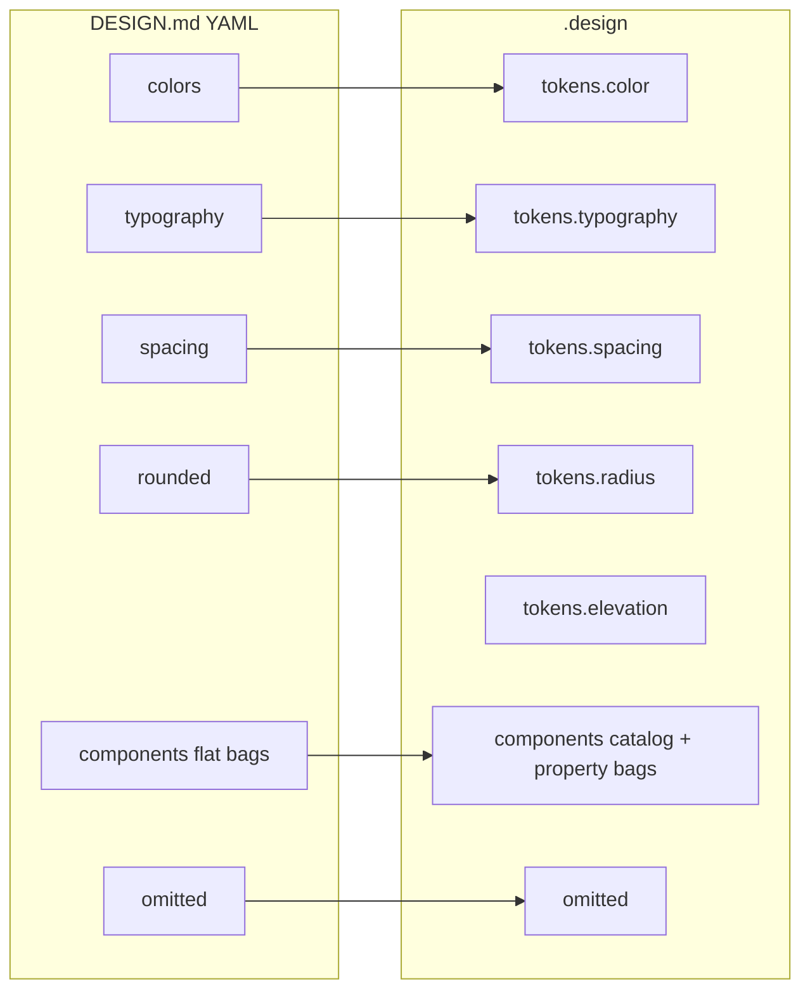

# DESIGN.md ↔ `.design` mapping

`.design` (design.v1) is its own format with **lossless import** of [Google DESIGN.md](https://github.com/google-labs-code/design.md/blob/main/docs/spec.md). Everything an agent needs from a DESIGN.md (frontmatter tokens + body rationale) maps completely into the living contract so nothing is lost while designing.

> **Verified against DESIGN.md 0.4.0 / spec version alpha (2026-07-27).** Their `docs/spec.md` is generated from `packages/cli/src/linter/spec-config.yaml` — diff against that file for future parity checks.

getdesign.md analyses follow the same DESIGN.md shape; examples in this repo are converted losslessly via `scripts/convert_getdesign.py`.

## Frontmatter → tokens / components



| DESIGN.md | `.design` | Notes |
| --- | --- | --- |
| `version` | *(nothing — see note)* | DESIGN.md's top-level `version` is the **format** version (only documented value: `alpha`), not the design system's version. Never copy it into `.design`'s SemVer `version` — record it in a `sources` note (e.g. "imported from DESIGN.md format alpha") and assign a fresh SemVer (e.g. `0.1.0`) on import |
| `name` / `description` | `schema` + `name` + `description` | `schema` is always `design.v1` |
| `colors.*` | `tokens.color.*` | Same CSS color values |
| `typography.*` | `tokens.typography.*` | Includes `fontFeature` / `fontVariation` |
| `spacing.*` | `tokens.spacing.*` | Unitless numbers allowed |
| `rounded.*` | `tokens.radius.*` | Rename on import (lenient). On **export** to DESIGN.md, unitless radius numbers MUST get a `px` suffix — DESIGN.md's `rounded` takes Dimension values only, and Dimension units are limited to `px` / `em` / `rem` |
| Nested groups in `colors` / `spacing` / `rounded` | Same nesting under `tokens.color` / `tokens.spacing` / `tokens.radius` | DESIGN.md ≥ 0.3.0 allows arbitrary nesting (depth ≤ 20) with dot-path refs; structure is preserved 1:1 (see below) |
| `components.<id>.*` | `components` | See component encoding below |
| `omitted` | `omitted` | Same semantics; DESIGN.md section/category names are preserved verbatim (see below) |
| `{colors.x}` refs | `{tokens.color.x}` | Auto-rewritten on import in **normative fields** (`tokens`, `components`); prose in `overview` / `rationale` may retain legacy `{colors.x}` refs in converted files |

### Nested token groups

DESIGN.md ≥ 0.3.0 supports arbitrary nesting depth (≤ 20) in `colors`, `spacing`, and `rounded`, referenced by dot-separated paths:

```yaml
# DESIGN.md
colors:
  background:
    light: "#ffffff"
# referenced as {colors.background.light}
```

imports as:

```yaml
# .design
tokens:
  color:
    background:
      light: "#ffffff"
# referenced as {tokens.color.background.light}
```

The prefix rewrite (`{colors.` → `{tokens.color.`) survives nesting unchanged — only the group prefix changes; the dot path beneath it is preserved as-is.

## Body sections → rationale / constraints

| DESIGN.md `##` section | `.design` field |
| --- | --- |
| Overview / Brand & Style | `overview` + `rationale.overview` |
| Colors | `rationale.colors` |
| Typography | `rationale.typography` |
| Layout / Layout & Spacing | `rationale.layout` |
| Elevation & Depth / Elevation | `rationale.elevation` (+ optional `tokens.elevation`) |
| Shapes | `rationale.shapes` |
| Components (prose) | `rationale.components` |
| Responsive / Iteration / Known Gaps | `rationale.responsive` / `iteration` / `known_gaps` |
| Other `##` headings | `rationale.<slug>` (never drop) |

Duplicate `##` headings in an imported DESIGN.md are an **error** — reject the file (or ask), matching DESIGN.md consumer behavior.

### `omitted` namespaces

Both namespaces are valid in `omitted`:

- Entries imported from DESIGN.md name frontmatter token categories and body sections by their **DESIGN.md names** (`spacing`, `typography`, `Do's and Don'ts`). Preserve these verbatim on import — do not blindly rewrite them to dot-paths, or round-tripping breaks.
- `.design`-native entries may use dot paths (`tokens.motion`).

## Components (critical)

DESIGN.md stores **flat** sibling keys with a fixed property whitelist:

```yaml
# DESIGN.md
components:
  button-primary:
    backgroundColor: "{colors.primary}"
    textColor: "{colors.on-primary}"
    typography: "{typography.body}"
    rounded: "{rounded.pill}"
    padding: 11px 22px
  button-primary-hover:
    backgroundColor: "{colors.primary-focus}"
```

`.design` accepts that form **and** a catalog form with usage rules:

```yaml
# .design catalog form
components:
  button:
    when: ["primary actions"]
    when_not: ["nav links"]
    variants: [button-primary, button-primary-hover]
    tokens:
      button-primary:
        backgroundColor: "{tokens.color.primary}"
        textColor: "{tokens.color.on-primary}"
        typography: "{tokens.typography.body}"
        rounded: "{tokens.radius.pill}"
        padding: "11px 22px"
      button-primary-hover:
        backgroundColor: "{tokens.color.primary-focus}"
```

### Property whitelist (must not be dropped)

| Property | Required support |
| --- | --- |
| `backgroundColor` | yes (alias `background`) |
| `textColor` | yes (alias `foreground`) |
| `typography` | yes |
| `rounded` | yes (alias `radius`) |
| `padding` | yes |
| `size` / `height` / `width` | yes |
| Unknown props | accept + warn (DESIGN.md consumer rule) |

Agents MUST bind every listed property when implementing a component — approximate restyles are a format violation.

## What `.design` adds (beyond DESIGN.md)

| Addition | Why |
| --- | --- |
| `intent`, `policy`, `decisions`, `patterns` | Agent decision procedures |
| `locked`, `status`, SemVer `version` | Lifecycle / ask-before-edit |
| `integrations.shadcn` | Theme → CSS variables / components.json |
| `agent.instructions` | Drop-in procedure stub |
| `when` / `when_not` | Stop inventing duplicate controls |

## Using the `@google/design.md` CLI alongside `.design`

When a repo carries a DESIGN.md, agents can shell out to the official CLI (`npx @google/design.md`) instead of re-implementing its tooling:

| Command | Use |
| --- | --- |
| `lint` | Validate a DESIGN.md before importing |
| `diff` | Per-group added/removed/modified report plus a **regression** boolean — useful when re-syncing after upstream edits |
| `export` | Generate CSS / Tailwind / DTCG artifacts (interop table below) |
| `spec` | Prints the DESIGN.md format spec for injection into agent prompts (`spec --rules` prints the lint rules) |

Export interop between the two formats:

| `.design` export | DESIGN.md CLI export format |
| --- | --- |
| `exports.css` | `css-vars` (CSS custom properties; supports a `--prefix` flag) |
| `exports.tailwind` (version 4) | `css-tailwind` (Tailwind v4 `@theme` CSS) |
| `exports.tailwind` (version 3) | `json-tailwind` (Tailwind v3 `theme.extend` JSON); their bare `tailwind` alias = v3 |
| `exports.dtcg` | `dtcg` (W3C DTCG) |

## Import checklist (human or agent)

When converting a DESIGN.md / getdesign analysis:

1. [ ] All color / type / spacing / rounded tokens copied (including nested groups, structure intact)  
2. [ ] Every component key + every property retained  
3. [ ] Hover/active/focus sibling keys retained  
4. [ ] All eight body sections landed in `rationale` (or `omitted` with reason)  
5. [ ] Do’s/Don’ts mirrored into `constraints`  
6. [ ] Token references rewritten to `tokens.*` in normative fields (prose may retain legacy refs)  
7. [ ] `.design` `version` freshly assigned as SemVer — DESIGN.md's format version (`alpha`) recorded in a `sources` note, never copied  
8. [ ] Provenance / sources cite the DESIGN.md URL  

Normative detail: [SPEC.md §11–§13B](../SPEC.md).
