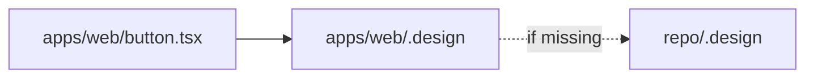

# Drop-in guide

Add `.design` to any repository in minutes.

## 1. Choose a filename

| Choice | When |
| --- | --- |
| `.design` | Default at repo or package root |
| `product.design` / `stripe.design` | Named systems or multiple brands |

Agents discover the nearest file walking up from the edited path (see [SPEC.md §4](../SPEC.md) and [overview.md](overview.md)).



## 2. Start from an example

Examples are sourced from [getdesign.md](https://getdesign.md/) analyses — adapt them; they are not official brand kits.

```bash
cp examples/vercel.design ./.design
# or
cp examples/stripe.design ./.design
cp examples/notion.design ./.design
cp examples/linear.design ./.design
cp examples/supabase.design ./.design
cp examples/apple.design ./.design
```

Edit `name`, `overview`, `intent.reference`, and `tokens` to match your product. Pipeline notes: [getdesign.md](getdesign.md).

## 3. Wire AGENTS.md

```markdown
## Design
- Before UI work: read `./.design` (or nearest `*.design`).
- Install/activate skill `design` when available.
- Follow tokens and components; edit `.design` when the system changes.
- If `integrations.shadcn.enabled`, apply CSS vars to globals.css and prefer shadcn UI.
- Ask before changing paths listed in `locked`.
```

## 4. Optional: local skill copy

```bash
mkdir -p .agents/skills
cp -r path/to/DESIGN/skills/design .agents/skills/design
```

Or:

```bash
npx skills add AgentsORG/DESIGN --skill design
```

## 5. Optional: shadcn

```bash
npx shadcn@latest init
```

Ensure `tailwind.cssVariables` is `true`, then apply theme from `.design`:

> “Apply `integrations.shadcn.css_vars` from `.design` into `app/globals.css`.”

Full guide: [shadcn.md](shadcn.md).

## 6. First tasks for the agent

```text
“Build a settings page using our .design file.”
“Verify globals.css matches integrations.shadcn.”
“Add a danger button variant to .design and use it on the delete flow.”
```

## Checklist

- [ ] `.design` or `*.design` at package/repo root  
- [ ] `schema: design.v1`  
- [ ] `intent.reference` is a specific sentence  
- [ ] `tokens` cover color + type at minimum  
- [ ] `AGENTS.md` points at the file  
- [ ] Skill installed (optional but recommended)  
- [ ] shadcn CSS vars synced (if using shadcn)  
- [ ] Sensitive brand paths listed in `locked` when ready  
