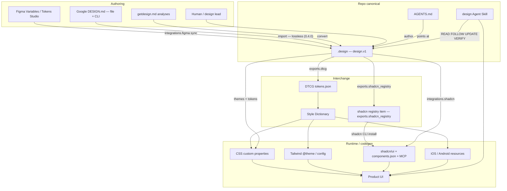
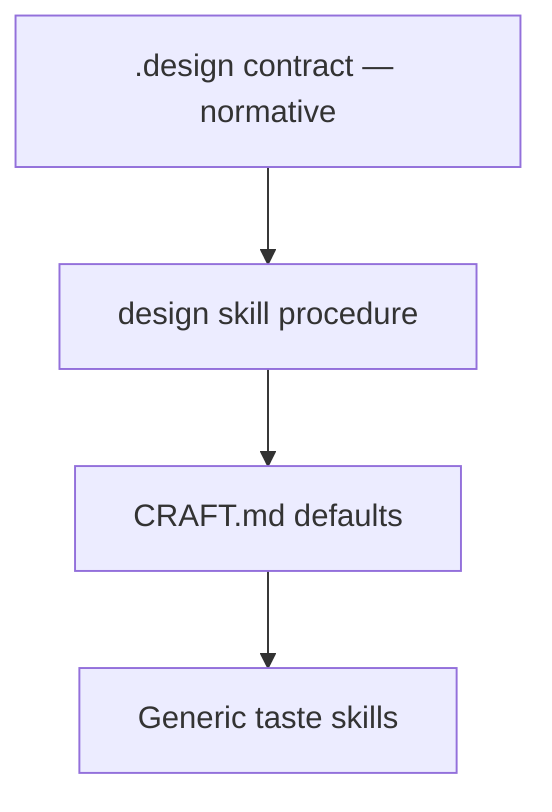
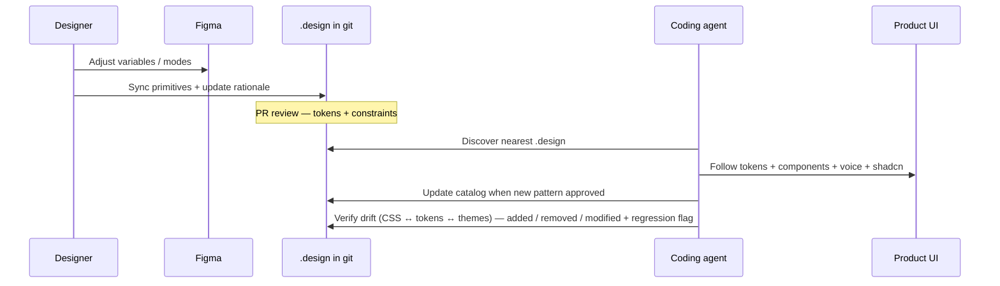

# Ecosystem map

How `.design` fits the full design-to-code stack used by agents and humans in 2026.

## One contract, many surfaces

## What each layer owns

| Layer | Owns | Does not own |
| --- | --- | --- |
| Figma | Visual exploration, variable primitives | Agent when/when_not, git history |
| Google DESIGN.md (file + CLI) | MD+YAML brand identity docs, incl. CLI-maintained analyses (0.4.0) | Policy, lifecycle, voice — gained on lossless import into `.design` |
| `.design` | Normative tokens, components, policy, voice, rationale, themes | Binary fonts, full page trees |
| `design` skill + CRAFT | Procedure + craft bar when contract is silent | Brand-specific tokens (those live in `.design`) |
| DTCG | Typed interchange (`$type` / `$value`) | Product taste / CTA rules |
| Style Dictionary | Multi-platform transforms | Brand judgment |
| shadcn | React primitives, CSS var theming, styles + `base` choice, namespaced registries, MCP server | Brand system of record |
| shadcn registry item (`exports.shadcn_registry`) | Distributable `registry:theme` payload derived from `css_vars` | Normative tokens (those stay in `.design`) |
| AGENTS.md | Repo pointer / install hint | Token values |

## Skill layers

Precedence: user prompt → nearest `.design` → design skill (procedure + CRAFT) → generic taste skills → model defaults.

## Recommended team pipeline

## Field coverage checklist

A production-ready `.design` for the “entire ecosystem” typically includes:

- [ ] `agent.instructions` (required — the file self-teaches on drop-in)
- [ ] `intent` with `reference`, `direction`, `signature`, `treatment`
- [ ] `voice` — register, casing, terminology, action naming, error style
- [ ] `tokens.color` / `typography` / `spacing` / `radius`
- [ ] `tokens.elevation` / `motion` / `breakpoint` / `iconography` / `background` (as needed)
- [ ] `themes.modes` for light/dark (or `themes.single` / `omitted` with reason)
- [ ] `components` with DESIGN.md property bags + `when` / `when_not`
- [ ] `rationale.*` for prose agents need beyond hex
- [ ] `constraints` + `policy` + `decisions`
- [ ] `integrations.shadcn` **or** documented non-shadcn stack
- [ ] `integrations.figma` when Figma is source
- [ ] `exports` paths for DTCG / CSS / Tailwind / shadcn registry CI
- [ ] `assets` path refs for logo/fonts
- [ ] `locked` on brand-critical paths
- [ ] `AGENTS.md` pointer + installed `design` skill

Normative detail: [SPEC.md](../SPEC.md) §7–§13B · [design-md-mapping.md](design-md-mapping.md) · [shadcn.md](shadcn.md).
