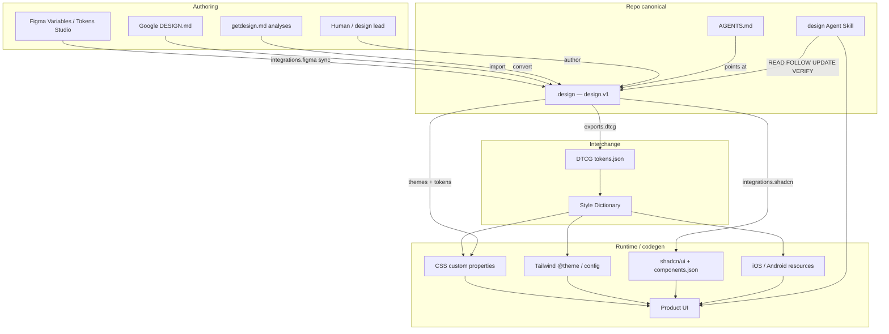
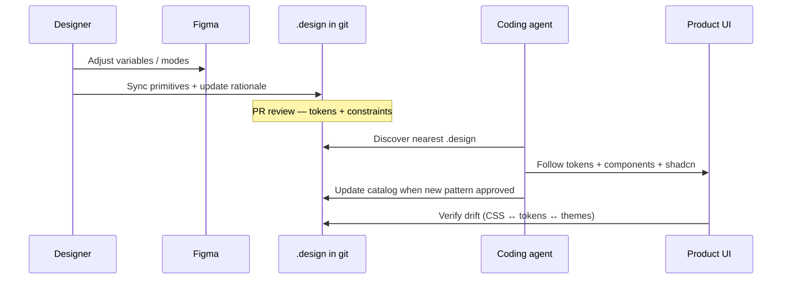

# Ecosystem map

How `.design` fits the full design-to-code stack used by agents and humans in 2026.

## One contract, many surfaces

## What each layer owns

| Layer | Owns | Does not own |
| --- | --- | --- |
| Figma | Visual exploration, variable primitives | Agent when/when_not, git history |
| `.design` | Normative tokens, components, policy, rationale, themes | Binary fonts, full page trees |
| DTCG | Typed interchange (`$type` / `$value`) | Product taste / CTA rules |
| Style Dictionary | Multi-platform transforms | Brand judgment |
| shadcn | React primitives + CSS var theming | Brand system of record |
| AGENTS.md + skill | Procedure | Token values |

## Recommended team pipeline

## Field coverage checklist

A production-ready `.design` for the “entire ecosystem” typically includes:

- [ ] `tokens.color` / `typography` / `spacing` / `radius`
- [ ] `tokens.elevation` / `motion` / `breakpoint` / `iconography` (as needed)
- [ ] `themes.modes` for light/dark (or `omitted` with reason)
- [ ] `components` with DESIGN.md property bags + `when` / `when_not`
- [ ] `rationale.*` for prose agents need beyond hex
- [ ] `constraints` + `policy` + `decisions`
- [ ] `integrations.shadcn` **or** documented non-shadcn stack
- [ ] `integrations.figma` when Figma is source
- [ ] `exports` paths for DTCG/CSS/Tailwind CI
- [ ] `assets` path refs for logo/fonts
- [ ] `locked` on brand-critical paths
- [ ] `AGENTS.md` pointer + installed `design` skill

Normative detail: [SPEC.md](../SPEC.md) §7–§13B · [design-md-mapping.md](design-md-mapping.md) · [shadcn.md](shadcn.md).
