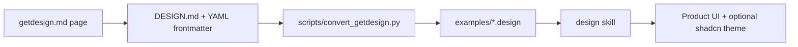
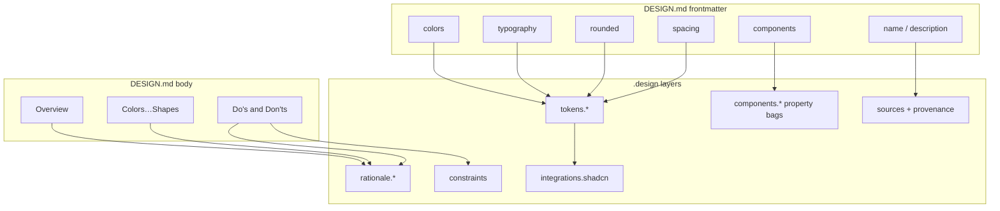
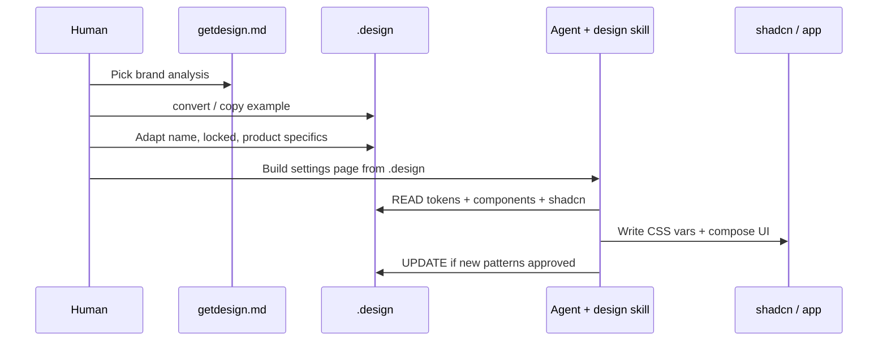

# getdesign.md → `.design`

[getdesign.md](https://getdesign.md/) publishes curated **DESIGN.md** brand analyses (YAML frontmatter: colors, typography, spacing, rounded, components, do/don't). This repo converts those analyses into conformant **design.v1** files under `examples/`.

> **Disclaimer:** Examples are **independent visual analyses**, not official brand kits. They are **not affiliated** with Vercel, Stripe, Notion, Apple, Linear, Supabase, or getdesign.md. Use them as teaching / starting points; re-author for production brands.

## Pipeline



## Included brands

| Example | getdesign page | Live site (provenance) |
| --- | --- | --- |
| `vercel.design` | [vercel/design-md](https://getdesign.md/vercel/design-md) | https://vercel.com |
| `stripe.design` | [stripe/design-md](https://getdesign.md/stripe/design-md) | https://stripe.com |
| `notion.design` | [notion/design-md](https://getdesign.md/notion/design-md) | https://notion.so |
| `apple.design` | [apple/design-md](https://getdesign.md/apple/design-md) | https://apple.com |
| `linear.design` | [linear.app/design-md](https://getdesign.md/linear.app/design-md) | https://linear.app |
| `supabase.design` | [supabase/design-md](https://getdesign.md/supabase/design-md) | https://supabase.com |

Upstream raw sources often also live in [awesome-design-md](https://github.com/voltagent/awesome-design-md).

## What the converter maps

Lossless vs [Google DESIGN.md](https://github.com/google-labs-code/design.md/blob/main/docs/spec.md): frontmatter **and** all body sections. See [design-md-mapping.md](design-md-mapping.md).



| Frontmatter / body | `.design` |
| --- | --- |
| `colors.*` | `tokens.color.*` |
| `typography.*` | `tokens.typography.*` |
| `rounded.*` | `tokens.radius.*` |
| `spacing.*` | `tokens.spacing.*` |
| `components.*` (+ all props) | `components.*.tokens` with DESIGN.md property names |
| Overview…Do’s/Don’ts (+ Responsive, Iteration, Known Gaps) | `rationale.*` + `constraints` |
| `omitted` | `omitted` (converter also records the intentionally absent `tokens.elevation` with a reason) |
| `version` | **not inherited** — the `.design` `version` is the contract's own SemVer, starting at `1.0.0` |
| — | `integrations.shadcn` |

Converter details:

- **Reference rewriting everywhere** — legacy refs (`{colors.x}`, `{typography.x}`, `{spacing.x}`, `{rounded.x}`) are rewritten to `{tokens.color.x}` etc. not only in token positions but inside **prose** too: `rationale.*` bodies, `constraints`, and dos/donts.
- **Typed `url` sources** — each example carries `sources` entries of `type: url` for the getdesign.md analysis page, the live brand site, and the upstream DESIGN.md, plus a non-affiliation note.
- **Real brand names** — upstream analyses that obfuscate names (e.g. "Stripi", "Supabaze") are corrected to the real brand; non-affiliation is covered by [NOTICE.md](../NOTICE.md) and `sources` notes.
- **Nothing dropped** — unknown `##` body sections are slugified into `rationale.*` rather than discarded; every DESIGN.md component variant key is preserved.

Import checklist and property whitelist: [design-md-mapping.md](design-md-mapping.md).


## Regenerate examples

1. Download DESIGN.md bodies into the repo root as `.tmp-<brand>-DESIGN.md` (or edit the script paths).
2. Run:

```bash
python scripts/convert_getdesign.py
```

The script removes previous `examples/*.design` files and writes the six brand systems above. CI validates every example against the schema and lint rules via `scripts/lint_design.py` on each push and pull request.

## Using a brand as your drop-in

```bash
cp examples/stripe.design ./.design
```

Then:

1. Change `name`, `overview`, `intent` (`reference`, `direction`, `signature`), and `voice` to **your** product (keep the reference sentence specific).
2. Lock paths you care about under `locked`.
3. If you use shadcn, apply `integrations.shadcn` → `globals.css` ([shadcn.md](shadcn.md)).
4. Trim unused components; add your real `import` paths.

## From getdesign to shipped UI



## Authoring your own (without getdesign)

You do not need getdesign.md. Bootstrap from [SPEC.md §22](../SPEC.md) or any example, then fill tokens from Figma / CSS / marketing. Keep `sources` honest.

See [human-authoring.md](human-authoring.md).
