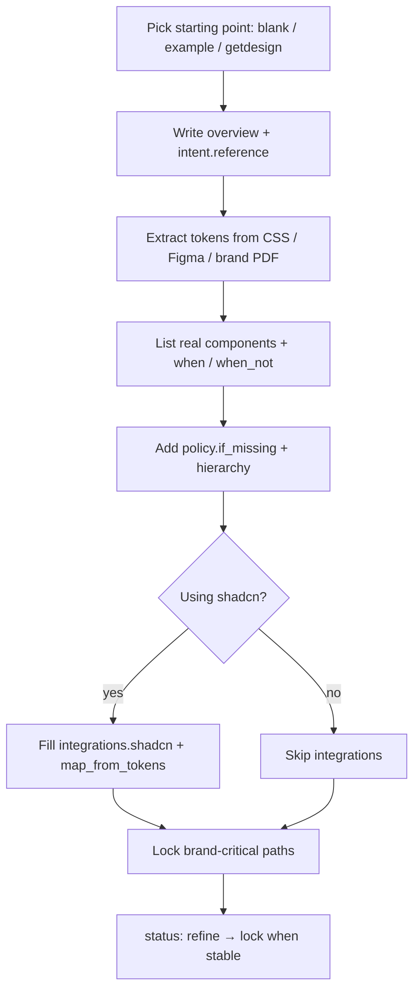

# Human authoring

How to write a good `.design` file as a human (or with an agent as scribe).

## Principles

1. **Specific reference** — `intent.reference` should name a concrete product or look, not “modern and clean.”  
2. **Tokens first** — colors, type, spacing, radius before long prose.  
3. **Catalog what you reuse** — if the agent should not invent a second Button, put Button in `components`.  
4. **Constraints are short laws** — `always` / `never` beat essays.  
5. **Lock what must not drift** — primary brand color, display font, logo clear-space.  
6. **Git is history** — do not invent in-file proposal queues.

## Minimal viable contract

Start from [SPEC.md §22](../SPEC.md) or copy an [example](../examples/), then delete what you do not need.

Required:

- `schema: design.v1`  
- `name`  
- `version`  

Strongly recommended:

- `status`, `overview`, `intent.reference`  
- `tokens.color`, `tokens.typography`  
- `constraints`  
- `agent.instructions`  

## Authoring flow



## Writing `intent.reference`

| Weak | Strong |
| --- | --- |
| Modern SaaS | Stripe Dashboard density without coldness |
| Clean dark UI | Linear.app marketing — graphite, violet accent, tight type |
| Friendly | Notion-like editorial calm with warm neutrals |

## Components

```yaml
components:
  button:
    when: ["primary actions", "form submit"]
    when_not: ["more than one filled primary per view"]
    variants: [filled, ghost, danger]
    states: [default, hover, disabled, loading]
```

Add `decisions.button` trees when variants need if/then clarity.

## Patterns

Use `patterns` for named surfaces (hero, settings, empty state) — allowed parts, forbidden parts, prioritize hints. One job per pattern.

## shadcn authors

If the product uses shadcn:

1. Set `integrations.shadcn.enabled: true`.  
2. Keep `css_variables: true`.  
3. Map brand tokens → semantic CSS vars ([shadcn.md](shadcn.md)).  
4. Point `css` and `components_json` at real paths.

## Provenance

Always record where the look came from:

```yaml
sources:
  - type: url
    ref: https://getdesign.md/stripe/design-md
    note: Starting analysis — adapted for Acme
provenance:
  owner: design@acme.com
  last_reviewed: "2026-08-05"
```

## Anti-patterns

- Dumping full page HTML into `.design`  
- Adjective-only intent with no reference  
- Duplicate token graphs (Tailwind theme vs `.design` vs random hex)  
- Locking everything on day one (blocks refine)  
- Claiming affiliation with brands you only analyzed visually  
