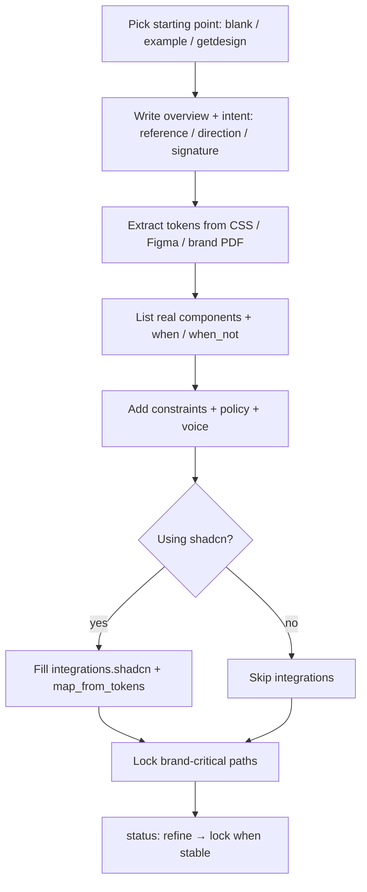

# Human authoring

How to write a good `.design` file as a human (or with an agent as scribe).

## Principles

1. **Specific reference** — `intent.reference` should name a concrete product or look, not “modern and clean.”  
2. **Tokens first** — colors, type, spacing, radius before long prose.  
3. **Catalog what you reuse** — if the agent should not invent a second Button, put Button in `components`.  
4. **Constraints are short laws** — `always` / `never` beat essays.  
5. **Lock what must not drift** — primary brand color, display font, logo clear-space.  
6. **Git is history** — do not invent in-file proposal queues.

## Minimal viable contract

Start from [SPEC.md §22](../SPEC.md) or copy an [example](../examples/), then delete what you do not need.

Required:

- `schema: design.v1`  
- `name`  
- `version`  
- `agent.instructions` — the self-contained procedure block; copy the canonical template from [self-contained.md](self-contained.md)  

Strongly recommended:

- `status`, `overview`, `intent.reference` (+ `direction`, `signature`, `treatment`)  
- `tokens.color`, `tokens.typography`  
- `constraints`  
- `voice`  

## Authoring flow



## Writing `intent.reference`

| Weak | Strong |
| --- | --- |
| Modern SaaS | Stripe Dashboard density without coldness |
| Clean dark UI | Linear.app marketing — graphite, violet accent, tight type |
| Friendly | Notion-like editorial calm with warm neutrals |

## Direction, signature, treatment

Three more `intent` fields sharpen the reference ([SPEC.md §9](../SPEC.md)):

- `direction` — the **committed** aesthetic direction, named (`minimal`, `editorial`, `brutalist`, `industrial`, `retro-futuristic`, …). One named direction beats three adjectives.  
- `signature` — the single bold element that carries the design (a mesh-gradient hero band, one saturated accent). Boldness concentrates here; everything around it stays quiet.  
- `treatment` — default register: `utilitarian` (restrained product craft) or `editorial` (distinctive identity for landing/marketing surfaces). Override per surface with `patterns.<name>.treatment`.  

```yaml
intent:
  reference: "Linear density with marketplace clarity"
  direction: editorial-minimal
  signature: "The mesh-gradient hero band — everything else stays monochrome"
  treatment: utilitarian
```

## Voice

Words are design material. `voice` is the UI copy contract, applied by agents with the same force as tokens ([SPEC.md §13C](../SPEC.md)):

```yaml
voice:
  register: "Plain, direct, technical-friendly. Confident, never cute."
  casing: sentence
  terminology:
    webhook_endpoint: "notification URL"   # system term → user term
  action_naming: "Button label names the exact action; the same verb carries through the flow."
  errors: "State what happened, why, and the next step. Never blame the user."
```

Fill the `terminology` map with every internal/system term users should never see.

## Writing constraints that work

From [SPEC.md §16.1](../SPEC.md):

- Write constraints as **absolute or numeric laws** (`never`, `always`, `≤ 300ms`) — hedged prose (“try to”, “where appropriate”, “tasteful”) does not change agent behavior.  
- Pair non-obvious rules with their **why** (in `rationale.*`) so they generalize to cases you never wrote down.  
- Encode judgment as decision procedures (`decisions.*` if→then, first match wins) rather than outcome descriptions — and not just for components: `decisions.typography` can carry size-threshold rules.  
- A good file constrains **dimensions** (type, color, motion, backgrounds), names the **defaults to avoid**, and gives one **specific reference** — it does not dictate every pixel.  

## Tokens can nest

Token groups nest to any depth (≤ 20 levels) and are addressed by full dot path; a token value may reference another token (chains ≤ 10):

```yaml
tokens:
  color:
    background:
      light: "#ffffff"
      dark: "#0a0a0a"
  background:
    section-wash: "linear-gradient(180deg, {tokens.color.background.light} 0%, #f5f5f5 100%)"
# ref: {tokens.color.background.light}
```

Use `tokens.background` for atmosphere (gradients, mesh, noise) and `tokens.motion` for shared durations, easing curves, and springs — new motion extends these tokens, never a parallel hand-typed set.

## Single-theme systems

If the product is deliberately one mode, say so — otherwise consumers warn about (or invent) a missing dark mode:

```yaml
themes:
  single: true
  reason: "Print-first editorial brand; no dark mode by design"
```

Multi-mode palettes must be **designed, not inverted** ([SPEC.md §7.3](../SPEC.md)).

## Components

```yaml
components:
  button:
    when: ["primary actions", "form submit"]
    when_not: ["more than one filled primary per view"]
    variants: [filled, ghost, danger]
    states: [default, hover, disabled, loading]
```

Add `decisions.button` trees when variants need if/then clarity.

## Patterns

Use `patterns` for named surfaces (hero, settings, empty state) — allowed parts, forbidden parts, prioritize hints. One job per pattern.

## shadcn authors

If the product uses shadcn:

1. Set `integrations.shadcn.enabled: true`.  
2. Keep `css_variables: true`.  
3. Map brand tokens → semantic CSS vars ([shadcn.md](shadcn.md)).  
4. Point `css` and `components_json` at real paths.

## Provenance

Always record where the look came from:

```yaml
sources:
  - type: url
    ref: https://getdesign.md/stripe/design-md
    note: Starting analysis — adapted for Acme
provenance:
  owner: design@acme.com
  last_reviewed: "2026-08-05"
```

## Anti-patterns

- Dumping full page HTML into `.design`  
- Adjective-only intent with no reference  
- Duplicate token graphs (Tailwind theme vs `.design` vs random hex)  
- Locking everything on day one (blocks refine)  
- Claiming affiliation with brands you only analyzed visually  
