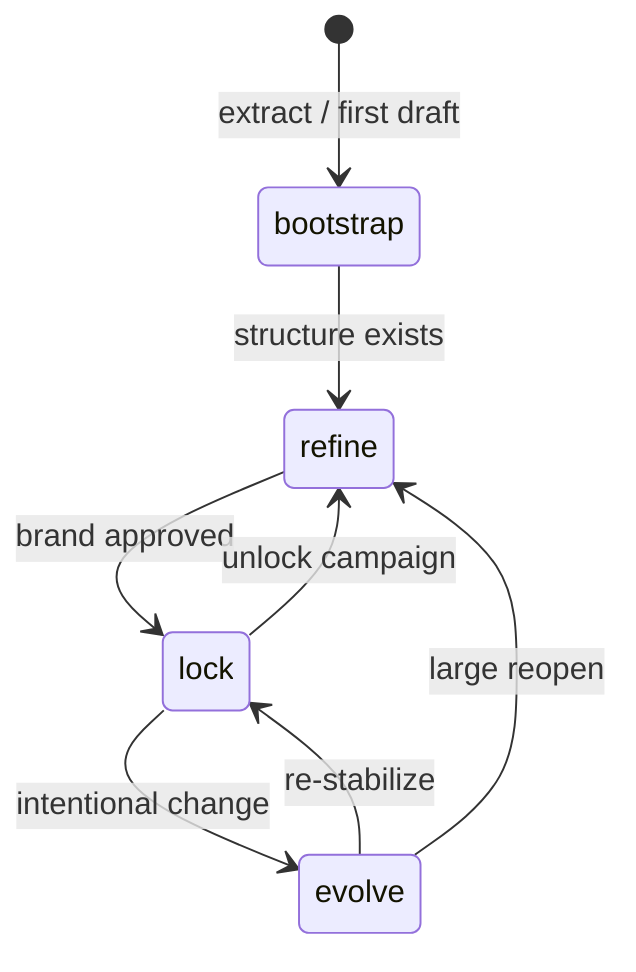
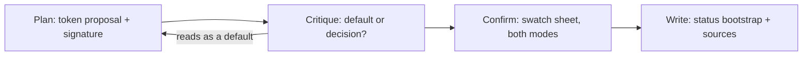
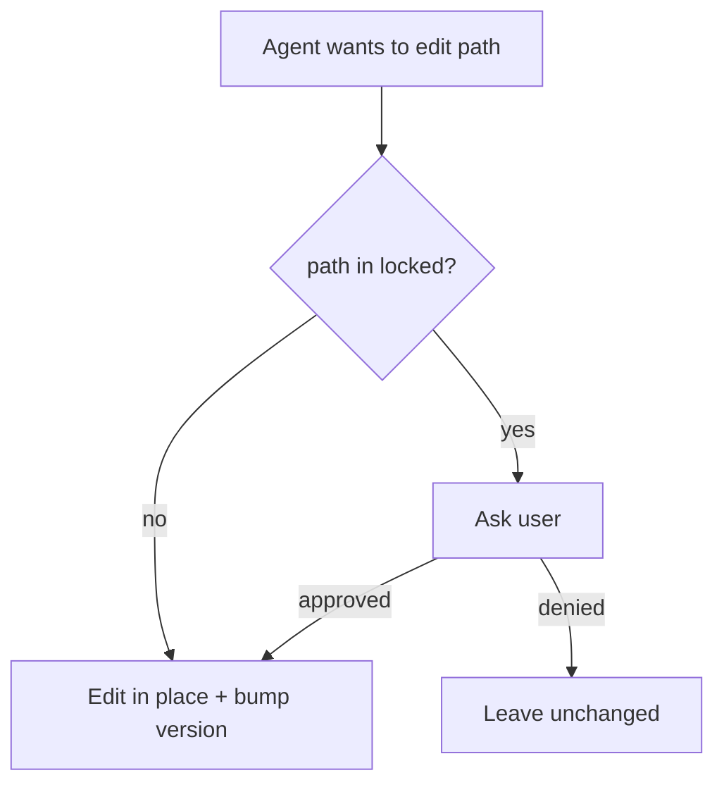

# Lifecycle

`.design` is a **living** contract. `status` tells agents how aggressive they may be when changing it.



## States

| Status | Agent posture |
| --- | --- |
| `bootstrap` | Fill freely from sources; expect churn; prefer notes in `sources` |
| `refine` | Improve tokens/components; SemVer MINOR/PATCH; still ask on `locked` |
| `lock` | Prefer not to change visuals; ask before token/component edits |
| `evolve` | Controlled change; protect `locked`; document why in commit messages |

## Bootstrap process: plan → critique → confirm → write

Bootstrap (and remix) is a two-pass process — the `.design` file *is* the design plan:



1. **Plan** — draft the token proposal: 4–6 named colors, 2+ type roles (characterful display used sparingly, complementary body, utility face), one-line layout intent, and the `intent.signature`.  
2. **Critique** — ask: *would this plan be identical for any similar product?* If yes, it is a default, not a decision — revise before writing.  
3. **Confirm** — for restyles, show a small swatch sheet (palette + type roles, both modes) and get user confirmation before mutating the contract.  
4. **Write** — fill the file, set `status: bootstrap`, populate `sources`; derive all subsequent UI only from the file.  

Before planning, scan adjacent design signals (`AGENTS.md` / `CLAUDE.md` design notes, an existing `DESIGN.md`, theme files, `components.json`, Storybook) — see [agent-consumption.md](agent-consumption.md).

## Locked paths

```yaml
locked:
  - tokens.color.primary
  - tokens.typography.display-xl
  - integrations.shadcn.style
```



## Version bumps (file `version`)

| Change | SemVer |
| --- | --- |
| Breaking visual or catalog rename | MAJOR |
| Additive token / component / pattern | MINOR |
| Clarification, typo, sync CSS vars to same tokens | PATCH |

History lives in **git**, not in the file.

## Verify reports

A `verify` run compares the contract to code (CSS vars, Tailwind theme, component imports) and reports findings **per token group** as **added / removed / modified**, plus a **regression** flag whenever anything consumers may rely on was removed or changed ([SPEC.md §18](../SPEC.md)). Fix only when asked.

## Recommended progression

1. **bootstrap** — convert from getdesign / Figma / CSS via plan → critique → confirm → write; status `bootstrap`.  
2. **refine** — ship a few screens; tighten constraints and decisions.  
3. **lock** — lock primary brand tokens; status `lock`.  
4. **evolve** — seasonal refresh or product shift; unlock only what must move.

See also [human-authoring.md](human-authoring.md) and [SPEC.md §6](../SPEC.md).
