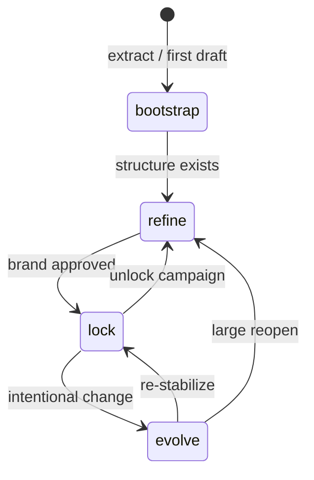
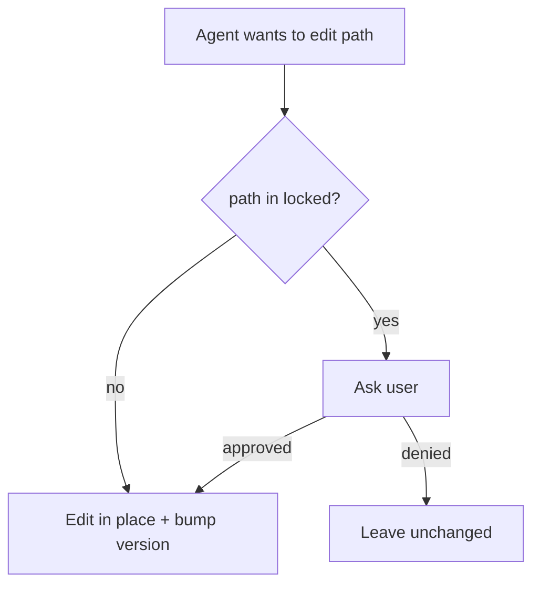

# Lifecycle

`.design` is a **living** contract. `status` tells agents how aggressive they may be when changing it.



## States

| Status | Agent posture |
| --- | --- |
| `bootstrap` | Fill freely from sources; expect churn; prefer notes in `sources` |
| `refine` | Improve tokens/components; SemVer MINOR/PATCH; still ask on `locked` |
| `lock` | Prefer not to change visuals; ask before token/component edits |
| `evolve` | Controlled change; protect `locked`; document why in commit messages |

## Locked paths

```yaml
locked:
  - tokens.color.primary
  - tokens.typography.display-xl
  - integrations.shadcn.style
```



## Version bumps (file `version`)

| Change | SemVer |
| --- | --- |
| Breaking visual or catalog rename | MAJOR |
| Additive token / component / pattern | MINOR |
| Clarification, typo, sync CSS vars to same tokens | PATCH |

History lives in **git**, not in the file.

## Recommended progression

1. **bootstrap** — convert from getdesign / Figma / CSS; status `bootstrap`.  
2. **refine** — ship a few screens; tighten constraints and decisions.  
3. **lock** — lock primary brand tokens; status `lock`.  
4. **evolve** — seasonal refresh or product shift; unlock only what must move.

See also [human-authoring.md](human-authoring.md) and [SPEC.md §6](../SPEC.md).
