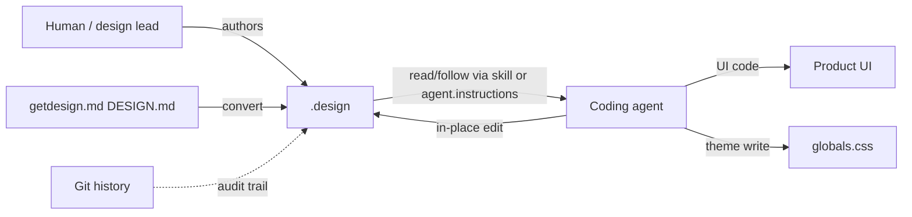
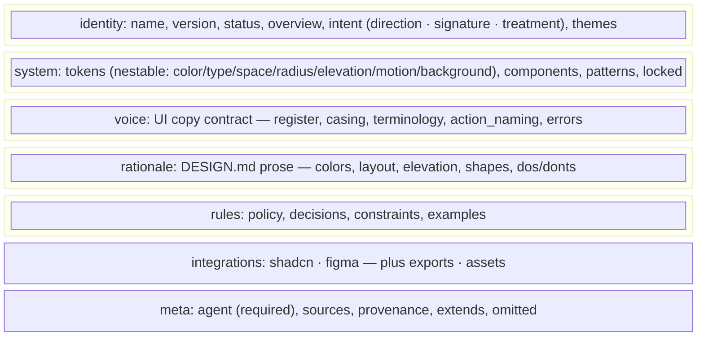
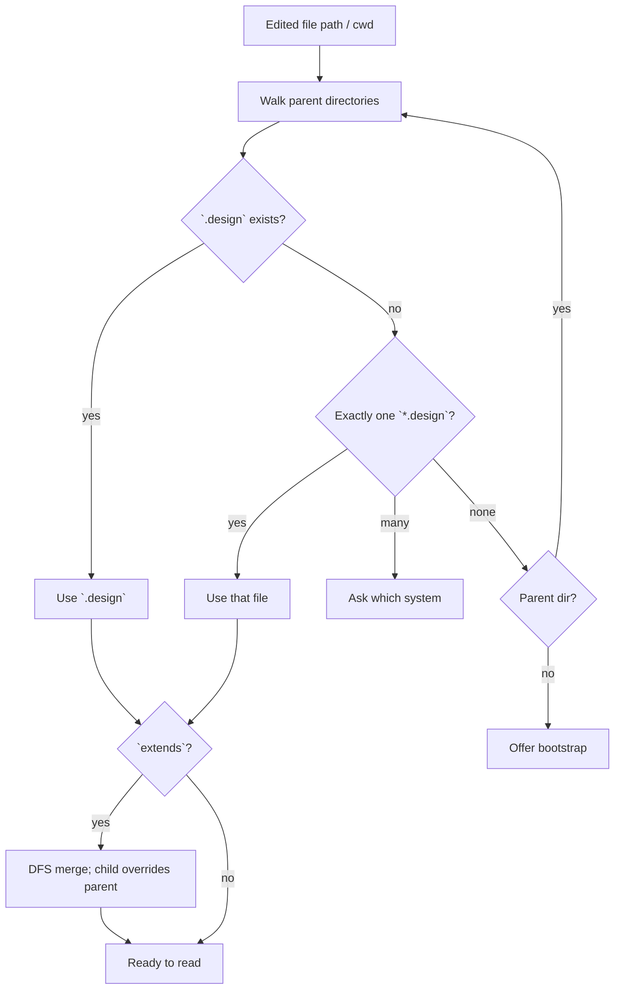
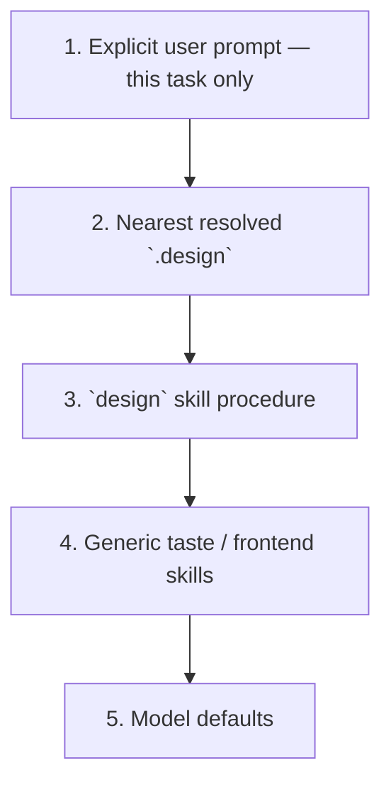
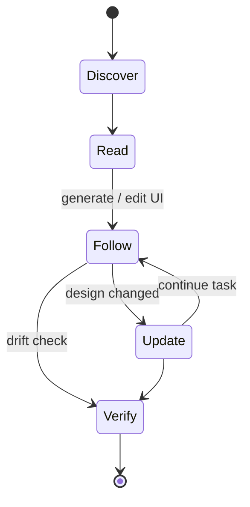
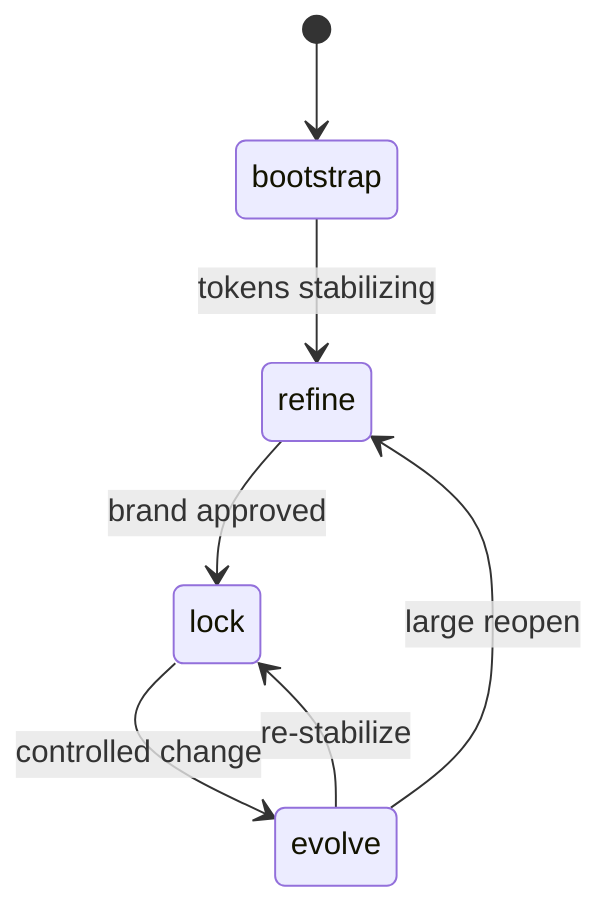
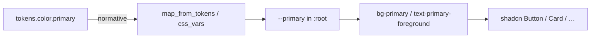

# Overview — how `.design` works

This page is the system map for **design.v1**. Normative rules live in [SPEC.md](../SPEC.md).

## What problem it solves

Agents need a **single portable contract** that:

1. Is machine-readable (YAML / JSON Schema).
2. Encodes tokens, components, policy, voice (UI copy), and a committed intent (`direction` · `signature` · `treatment`).
3. Can be updated in place as the product design evolves.
4. Bridges common codegen stacks (especially [shadcn/ui](https://ui.shadcn.com/)).
5. Can be bootstrapped from public brand analyses like [getdesign.md](https://getdesign.md/).

## File shape (layers)

| Layer | Fields | Agent duty |
| --- | --- | --- |
| Identity | `name`, `version`, `status`, `overview`, `intent` (`direction`, `signature`, `treatment`), `themes` | Orient taste; commit to the direction; calibrate treatment per surface (`patterns.<name>.treatment` overrides) |
| System | `tokens` (nestable groups, ref chains), `components`, `patterns`, `locked` | Bind every component property; reuse catalog; ask on locked |
| Voice | `voice` | Apply copy rules (register, casing, terminology, action naming, errors) with the same force as tokens |
| Rationale | `rationale.*` | Apply DESIGN.md body guidance tokens omit |
| Rules | `policy`, `decisions`, `constraints`, `examples` | Resolve conflicts and missing pieces |
| Integrations | `integrations.shadcn`, `integrations.figma`, `exports`, `assets` | Theme CSS vars + prefer shadcn primitives; emit declared exports |
| Meta | `agent` (required `instructions`), `sources`, `provenance`, `extends`, `omitted` | Self-teach procedure + provenance + intentional gaps |

## Discovery (nearest wins)

Monorepo packages can own a nearer `.design` that overrides the repo root.

## Precedence

## Agent loop

Large files read in tiers (SPEC §8.1): normative core first (`intent`, `constraints`, `policy`/`decisions`, `tokens`, `components`, `voice`, `locked`), judgment prose on demand, tooling sections only when performing that operation. `verify` reports **added / removed / modified** per token group plus a **regression** flag (SPEC §18).

Detailed procedures: [agent-consumption.md](agent-consumption.md) · Skill: [skills/design/SKILL.md](../skills/design/SKILL.md).

## Lifecycle

| Status | Meaning |
| --- | --- |
| `bootstrap` | Draft extraction; expect churn |
| `refine` | Actively shaping the system |
| `lock` | Stable; prefer ask before visual changes |
| `evolve` | Intentional change while protecting `locked` paths |

See [lifecycle.md](lifecycle.md).

## Tokens vs shadcn CSS variables

**Tokens win** if they disagree with `integrations.shadcn.css_vars`. Agents MUST update CSS vars to match tokens. Full guide: [shadcn.md](shadcn.md).

## Updating (no in-file history)

Edit the YAML **in place**. Do not add `proposed_changes`, `history`, or ops queues — **git** is the audit trail. Ask before changing any path listed in `locked`.

## Related docs

- [drop-in.md](drop-in.md) — install in a product repo  
- [getdesign.md](getdesign.md) — convert brand DESIGN.md analyses  
- [shadcn.md](shadcn.md) — theme + components.json  
- [comparison.md](comparison.md) — adjacent formats  
- [human-authoring.md](human-authoring.md) — writing good contracts  
