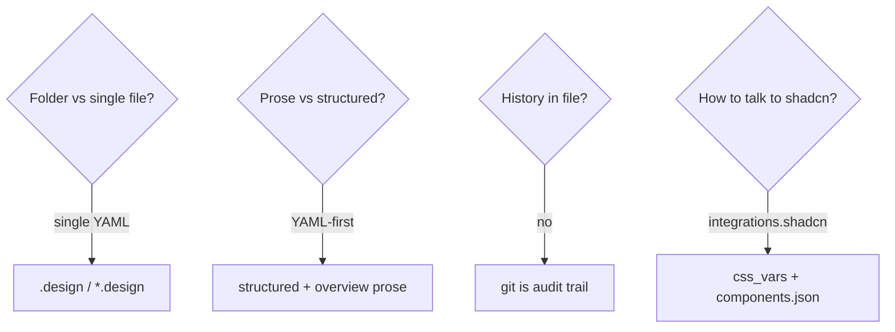

# Research notes

Background that informed **design.v1**. Not normative — see [SPEC.md](../SPEC.md).

## Influences

| Source | Takeaway |
| --- | --- |
| [Google DESIGN.md](https://github.com/google-labs-code/design.md) | Portable design identity; MD+YAML hybrid |
| DTCG token format | Interchange for color/type/space — export target |
| [AGENTS.md](https://agents.md/) | Repo-level agent instructions |
| [agentskills.io](https://agentskills.io/) / skills.sh | Portable procedures separate from data |
| [shadcn/ui](https://ui.shadcn.com/) | De facto agent codegen + CSS-variable theming |
| [getdesign.md](https://getdesign.md/) | Curated brand DESIGN.md analyses for bootstrap |
| OpenAPI | Single-file contract metaphor for “API of the visual system” |

## Design decisions

1. **Single file** — drop-in, easy discovery, git-friendly diffs.  
2. **YAML-first** — JSON Schema validation; JSON-serializable.  
3. **No in-file history / proposal queues** — reduces agent bikeshedding; git wins.  
4. **Nearest-wins discovery** — monorepo friendly.  
5. **shadcn as integration, not dependency** — optional `integrations.shadcn`; tokens remain normative.  
6. **Examples from getdesign.md** — realistic multi-brand teaching set with clear disclaimers.

## Open follow-ups (non-blocking for v1)

- CLI: `lint`, `diff`, `verify`, `export-dtcg`, `apply-shadcn-css`  
- Official registry of community `*.design` files  
- Deeper dark-mode / chart / sidebar token coverage in converters  

## Links

- Spec: [SPEC.md](../SPEC.md)  
- Philosophy: [PHILOSOPHY.md](../PHILOSOPHY.md)  
- Overview diagrams: [overview.md](overview.md)  
