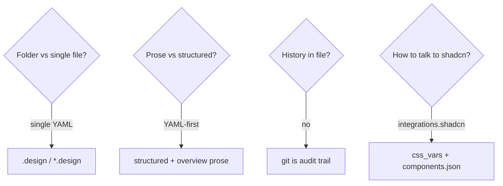

# Research notes

Background that informed **design.v1**. Not normative — see [SPEC.md](../SPEC.md).

## Influences

| Source | Takeaway |
| --- | --- |
| [Google DESIGN.md](https://github.com/google-labs-code/design.md) | Portable design identity; MD+YAML hybrid |
| DTCG token format | Interchange for color/type/space — export target |
| [AGENTS.md](https://agents.md/) | Repo-level agent instructions |
| [agentskills.io](https://agentskills.io/) / skills.sh | Portable procedures separate from data |
| [shadcn/ui](https://ui.shadcn.com/) | De facto agent codegen + CSS-variable theming |
| [getdesign.md](https://getdesign.md/) | Curated brand DESIGN.md analyses for bootstrap |
| OpenAPI | Single-file contract metaphor for “API of the visual system” |

## Design decisions

1. **Single file** — drop-in, easy discovery, git-friendly diffs.  
2. **YAML-first** — JSON Schema validation; JSON-serializable.  
3. **No in-file history / proposal queues** — reduces agent bikeshedding; git wins.  
4. **Nearest-wins discovery** — monorepo friendly.  
5. **shadcn as integration, not dependency** — optional `integrations.shadcn`; tokens remain normative.  
6. **Examples from getdesign.md** — realistic multi-brand teaching set with clear disclaimers.

## Verified 2026-08 update

State check against the ecosystem as of August 2026, recorded so later readers know what this spec revision was validated against. The notes above are historical and unchanged.

- **Google DESIGN.md 0.4.0** — the interop mapping (SPEC §7, §11.3, §13) was re-verified against DESIGN.md 0.4.0: frontmatter token groups, component property bags, `omitted`, legacy token refs, reference-chain depth 10, and nesting depth 20 all still match. Positioning stands: `.design` is **its own format** that imports DESIGN.md **losslessly** (complete mapping) — not a superset.
- **shadcn/ui current model** — styles `vega` / `nova` / `maia` / `lyra` / `mira` / `luma` / `rhea` / `sera` (`new-york` legacy), primitive `base` choice (`base` \| `radix` \| `react-aria`), `icon_library`, init presets, namespaced `registries` (`@ns` → URL, never guessed), an MCP server, and the full CSS-variable set including `chart-1`…`chart-5`, `sidebar-*`, and mode-independent `css_vars.theme`; on Tailwind v4, custom variables must also register under `@theme inline`. SPEC §7.1 reflects all of this, and `exports.shadcn_registry` emits an installable `registry:theme` item.
- **What v1.1 absorbed** — `voice` (§13C, applied with token force); `intent.direction` / `signature` / `treatment` with `patterns.<name>.treatment` per-surface overrides; required top-level `agent` with the canonical self-contained instructions template (§8) and reading tiers for large files (§8.1); nested token groups (depth ≤ 20) with token→token reference chains (depth ≤ 10); `tokens.background` atmosphere and `tokens.motion` easing/spring tokens; `policy.color.accent_cycle`; `decisions.*` generalized beyond components; `themes.single`, the designed-not-inverted mode rule, and `exports.css.mode_strategy`; `exports.shadcn_registry`, `exports.tailwind` `version: 3`, and `exports.css.prefix`; constraint-authoring guidance (§16.1); the expanded validation table (§19); and `verify` reporting added / removed / modified per group with a regression flag (§18).
- **CI** — every example now validates against the schema via `scripts/lint_design.py` in GitHub Actions.

## Open follow-ups (non-blocking for v1)

- CLI: `diff`, `verify`, `export-dtcg`, `apply-shadcn-css` (`lint` exists as `scripts/lint_design.py`, run in CI)  
- Official registry of community `*.design` files  
- Converter coverage for the full dark-mode / chart / sidebar variable set (SPEC §7.1 now specifies it)  

## Links

- Spec: [SPEC.md](../SPEC.md)  
- Philosophy: [PHILOSOPHY.md](../PHILOSOPHY.md)  
- Overview diagrams: [overview.md](overview.md)  
