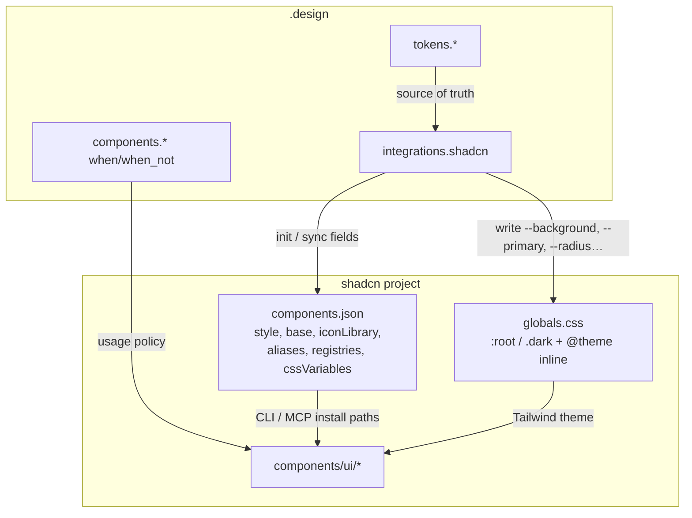
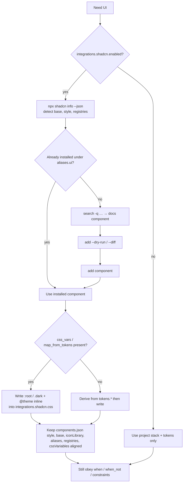

# shadcn/ui integration

`.design` does **not** replace [shadcn/ui](https://ui.shadcn.com/). It **orchestrates** it: tokens stay normative in YAML; agents write [theme CSS variables](https://ui.shadcn.com/docs/theming) into your global CSS and prefer installed shadcn components.

Official references:

- [ui.shadcn.com](https://ui.shadcn.com/)
- [Theming](https://ui.shadcn.com/docs/theming)
- [components.json](https://ui.shadcn.com/docs/components-json)
- [Tailwind v4](https://ui.shadcn.com/docs/tailwind-v4)
- [CLI](https://ui.shadcn.com/docs/cli)
- [MCP](https://ui.shadcn.com/docs/mcp)
- [Registry](https://ui.shadcn.com/docs/registry)
- [registry-item.json](https://ui.shadcn.com/docs/registry/registry-item-json)
- [Registry namespaces](https://ui.shadcn.com/docs/registry/namespace)

## Why integrate

| Without `.design` | With `integrations.shadcn` |
| --- | --- |
| Agents invent one-off Button styles | Prefer `@/components/ui/*` |
| Theme drifts across chats | CSS vars regenerated from contract |
| `components.json` and brand diverge | Style / base / aliases / registries kept in sync |
| Hex scattered in JSX | Semantic `bg-primary`, `text-muted-foreground` |

## Artifact roles



| Artifact | Role |
| --- | --- |
| `.design` `tokens` | Normative brand values |
| `.design` `integrations.shadcn` | Mapping + CLI-aligned config |
| `components.json` | Style, base, iconLibrary, RSC, aliases, registries |
| `globals.css` | Concrete `--*` theme tokens (`:root` / `.dark` + `@theme inline`) |
| DTCG `tokens.json` (optional) | Export for other tools — not required |

## Schema shape

```yaml
integrations:
  shadcn:
    enabled: true
    style: nova                  # components.json "style": vega, nova, maia, lyra,
                                 # mira, luma, rhea, sera (+ legacy new-york)
    base: base                   # primitive library: base | radix | react-aria
    icon_library: lucide         # components.json "iconLibrary"
    preset: base-nova            # init preset = base + style combo, NOT a style
    css_variables: true          # MUST be true for token-driven theming
    base_color: neutral          # neutral | stone | zinc | mauve | olive | mist | taupe
                                 # brand comes from css_vars; immutable after init
    css: app/globals.css
    components_json: ./components.json
    rsc: true
    tsx: true
    aliases:
      components: "@/components"
      utils: "@/lib/utils"
      ui: "@/components/ui"
      lib: "@/lib"
      hooks: "@/hooks"
    registries:
      "@brand": "https://registry.example.com/{name}.json"
      "@internal":
        url: "https://registry.internal.example.com/{name}.json"
        headers:
          Authorization: "Bearer ${REGISTRY_TOKEN}"   # env expansion — never inline secrets
        params:
          team: design
    components:                  # optional: canonical items to install
      - button
      - card
      - input
      - "@brand/hero"
    radius: "0.5rem"             # → --radius (base of radius scale)
    css_vars:
      # Values are any valid CSS color, written verbatim into the CSS file.
      # Upstream shadcn ships oklch() since Tailwind v4; hex is equally valid.
      # Keep the format consistent with tokens.* — never wrap values in hsl().
      theme:                     # mode-independent vars: radius, fonts, tracking
        font-sans: "Inter, sans-serif"
      light:
        background: "#ffffff"
        foreground: "#0a0a0a"
        primary: "#0a0a0a"
        primary-foreground: "#fafafa"
        secondary: "#f4f4f5"
        secondary-foreground: "#0a0a0a"
        muted: "#f4f4f5"
        muted-foreground: "#71717a"
        accent: "#f4f4f5"
        accent-foreground: "#0a0a0a"
        destructive: "#dc2626"
        border: "#e4e4e7"
        input: "#e4e4e7"
        ring: "#0a0a0a"
        card: "#ffffff"
        card-foreground: "#0a0a0a"
        popover: "#ffffff"
        popover-foreground: "#0a0a0a"
        chart-1: "#2563eb"
        chart-2: "#0d9488"
        chart-3: "#d97706"
        chart-4: "#7c3aed"
        chart-5: "#db2777"
        sidebar: "#fafafa"
        sidebar-foreground: "#0a0a0a"
        sidebar-primary: "#0a0a0a"
        sidebar-primary-foreground: "#fafafa"
        sidebar-accent: "#f4f4f5"
        sidebar-accent-foreground: "#0a0a0a"
        sidebar-border: "#e4e4e7"
        sidebar-ring: "#0a0a0a"
      dark:
        background: "#0a0a0a"
        foreground: "#fafafa"
        # …same keys
    map_from_tokens:
      background: tokens.color.canvas
      foreground: tokens.color.ink
      primary: tokens.color.primary
      primary-foreground: tokens.color.on-primary
      border: tokens.color.hairline
      ring: tokens.color.primary
```

Normative field docs: [SPEC.md §7.1](../SPEC.md).

Notes on the fields that changed with current shadcn:

- **`style`** — the `default` style is deprecated; `new-york` is the legacy default. Current shadcn ships eight styles: `vega`, `nova`, `maia`, `lyra`, `mira`, `luma`, `rhea`, `sera`.
- **`base`** — the primitive library under the components: `base` (the current default), `radix`, or `react-aria`. Registries read `style` / `base` / `iconLibrary` so installed components adapt automatically.
- **`preset`** — a base + style combination such as `base-nova` or `radix-nova` (`npx shadcn init --preset base-nova`). A preset is **not** a style; do not put preset names in `style`.
- **`base_color` / `css_variables`** — map to `tailwind.baseColor` / `tailwind.cssVariables` in `components.json`. Both are **immutable after initialization**: restyling happens through `css_vars` (or `apply` / presets), never by re-running init or editing these fields.
- **`registries`** — map of `@namespace` → URL string or `{url, headers, params}` object. Secrets go through `${ENV_VAR}` expansion only. These feed `components.json.registries`, enabling `npx shadcn add @brand/hero` and cross-registry `registryDependencies`.

## Semantic token convention (shadcn)

shadcn uses **background / foreground pairs**. The base token paints the surface; `*-foreground` paints content on that surface.

| CSS variable | Typical use |
| --- | --- |
| `--background` / `--foreground` | Page shell, default text |
| `--card` / `--card-foreground` | Elevated panels |
| `--popover` / `--popover-foreground` | Menus, overlays |
| `--primary` / `--primary-foreground` | Primary Button, strong accents |
| `--secondary` / `--secondary-foreground` | Secondary actions |
| `--muted` / `--muted-foreground` | Helper text, subtle surfaces |
| `--accent` / `--accent-foreground` | Hover / selected chrome |
| `--destructive` | Danger actions |
| `--border`, `--input`, `--ring` | Borders, fields, focus |
| `--chart-1` … `--chart-5` | Categorical data-viz series |
| `--sidebar` / `--sidebar-foreground` | Sidebar shell, sidebar text |
| `--sidebar-primary` / `--sidebar-primary-foreground` | Sidebar active items |
| `--sidebar-accent` / `--sidebar-accent-foreground` | Sidebar hover / selected |
| `--sidebar-border`, `--sidebar-ring` | Sidebar borders, focus |
| `--radius` | Base corner; derived `radius-sm`…`radius-4xl` |

Chart and sidebar variables are part of the **standard** theme set, not optional extras. When writing a theme, emit the full current variable set: charts SHOULD derive from `tokens.color` data / accent ramps; sidebar defaults may mirror `background` / `primary` / `accent`.

## Tailwind v4 mechanics

On Tailwind v4 (the current default for shadcn projects):

- Theme variables live at `:root` and `.dark` **outside** `@layer base`.
- Any **custom** variable beyond the standard set MUST also be registered under `@theme inline` (`--color-brand: var(--brand);`) — otherwise no utility class (`bg-brand`) exists for it.
- `tailwind.config` stays **blank** in `components.json` — v4 is configured in CSS.
- `tw-animate-css` replaces the deprecated `tailwindcss-animate`.
- Upstream theme values are `oklch()`; `css_vars` values are written verbatim, so either match that format or stay consistently in your token format. Never wrap values in `hsl()`.

## Agent workflow



The current CLI is agent-aware. The canonical sequence:

1. `npx shadcn info --json` — project context: base, style, iconLibrary, registries, installed components.
2. Check what is already installed under `aliases.ui` before adding anything.
3. `npx shadcn search -q "<term>"` — find items across configured registries.
4. `npx shadcn docs <component>` — read usage before writing code.
5. `npx shadcn add <component> --dry-run` (or `--diff`) — preview what changes.
6. `npx shadcn add <component>` — install; then verify import aliases, especially after third-party registry adds.

To restyle an existing app, use `npx shadcn apply <code> --only theme,font` or presets — not a re-init.

### MUST

1. Prefer installing/using shadcn components instead of inventing parallel primitives when `enabled: true`.
2. Run `npx shadcn info --json` first and match the project's primitive base (`base` | `radix` | `react-aria`) when writing component code — detect it, never assume.
3. Set / keep `tailwind.cssVariables: true` in `components.json`.
4. Write theme values into the CSS file at `integrations.shadcn.css` — `:root` / `.dark` outside `@layer base`, custom variables also registered under `@theme inline`.
5. Emit the full current variable set, including `chart-1`…`chart-5` and the sidebar variables.
6. Preview with `add --dry-run` / `--diff` before writing, and verify import aliases after third-party registry installs.
7. Keep `components.json` `style`, `base`, `iconLibrary`, `aliases` (incl. `lib` / `hooks`), `registries`, and `tailwind.baseColor` / `cssVariables` aligned with `integrations.shadcn`.
8. Treat `tokens.*` as winning over stale `css_vars` literals — refresh CSS after token edits.
9. Respect `components.*` `when` / `when_not` even for shadcn-backed controls.

### MUST NOT

1. Force a new styling stack if the repo is not on Tailwind/shadcn.
2. Scatter hardcoded hex in JSX when a CSS variable / token exists.
3. Silently overwrite `locked` token paths.
4. Re-init or edit `tailwind.baseColor` / `tailwind.cssVariables` after initialization — they are immutable; restyle via `css_vars` or `apply`.
5. Guess registry namespaces — install only from registries declared in `integrations.shadcn.registries` / `components.json`.
6. Mix primitive libraries — one `base` per project.
7. Wrap `css_vars` values in `hsl()` — values are written verbatim.
8. Populate `tailwind.config` on Tailwind v4, or add `tailwindcss-animate` (use `tw-animate-css`).

## shadcn MCP server

shadcn ships an official [MCP server](https://ui.shadcn.com/docs/mcp): `npx shadcn@latest mcp` (configure once with `npx shadcn@latest mcp init`). It lets agents browse, search, view, and install components from **all** registries configured in `components.json` — including private, authenticated ones.

- When the shadcn MCP server is available, agents SHOULD use it for search / view / add instead of shelling out to the CLI.
- The `integrations.shadcn.registries` map feeds `components.json`, which is exactly what the MCP server reads — declaring brand registries in `.design` makes them agent-discoverable.

## Distributing the brand as a registry item

A `.design` theme maps 1:1 onto shadcn's [registry-item.json](https://ui.shadcn.com/docs/registry/registry-item-json), which makes the brand installable into **any** shadcn project:

| registry item | source in `.design` |
| --- | --- |
| `type: registry:theme` (or `registry:style` / `registry:base`) | `integrations.shadcn` |
| `cssVars.light` / `cssVars.dark` | `css_vars.light` / `css_vars.dark` |
| `cssVars.theme` (mode-independent: radius, fonts, tracking) | `css_vars.theme`, `radius` |
| `name` / `title` / `description` | `meta.*` |

Build with `npx shadcn build`, serve the output, and any project can install the brand via `npx shadcn add <url>` or `npx shadcn add @brand/theme` once the namespace is registered. This pairs with the `.design` `exports.shadcn_registry` target — the [registry docs](https://ui.shadcn.com/docs/registry) cover hosting and namespacing ([namespace](https://ui.shadcn.com/docs/registry/namespace)).

## Mapping from getdesign-style tokens

Examples in this repo map brand tokens roughly as:

| Brand token | shadcn var |
| --- | --- |
| `canvas` / `surface` / `background` | `background` |
| `ink` / `text` / `foreground` | `foreground` |
| `primary` | `primary` |
| `on-primary` | `primary-foreground` |
| `hairline` / `border` | `border`, `input` |
| `mute` / muted text | `muted-foreground` |
| `error` / danger | `destructive` |
| data / accent ramps | `chart-1`…`chart-5` |
| `tokens.radius.*` mid step | `radius` |

Exact mappings live in each example’s `integrations.shadcn.map_from_tokens`.

## Init checklist (new app)

1. Copy an example → `.design` and adapt brand copy/tokens.
2. `npx shadcn@latest init` (optionally `--preset base-nova`) with `cssVariables: true`, matching `style` / `base` / `base_color` / `icon_library` / aliases. `baseColor` and `cssVariables` cannot change after this step — pick deliberately.
3. Ask agent: *“Apply integrations.shadcn.css_vars to globals.css from .design”* (`:root` / `.dark` + `@theme inline` for custom vars).
4. Per component: `npx shadcn info --json` → `search -q` → `docs` → `add --dry-run` → `add`.
5. Build UI citing tokens + shadcn components used.

## Example files with shadcn blocks

All [examples/](../examples/) include `integrations.shadcn` (Vercel, Stripe, Notion, Apple, Linear, Supabase).

## Conflict resolution

```text
tokens.color.primary ≠ css_vars.light.primary
→ tokens win
→ update css_vars + globals.css
→ note the sync in the PR / summary
```
