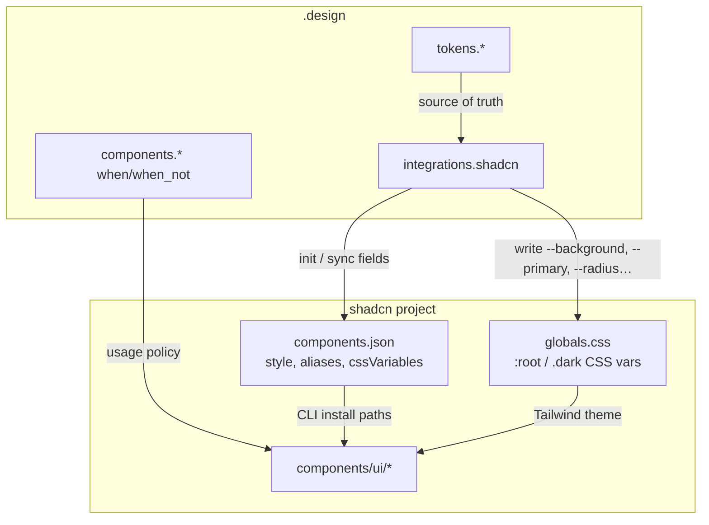
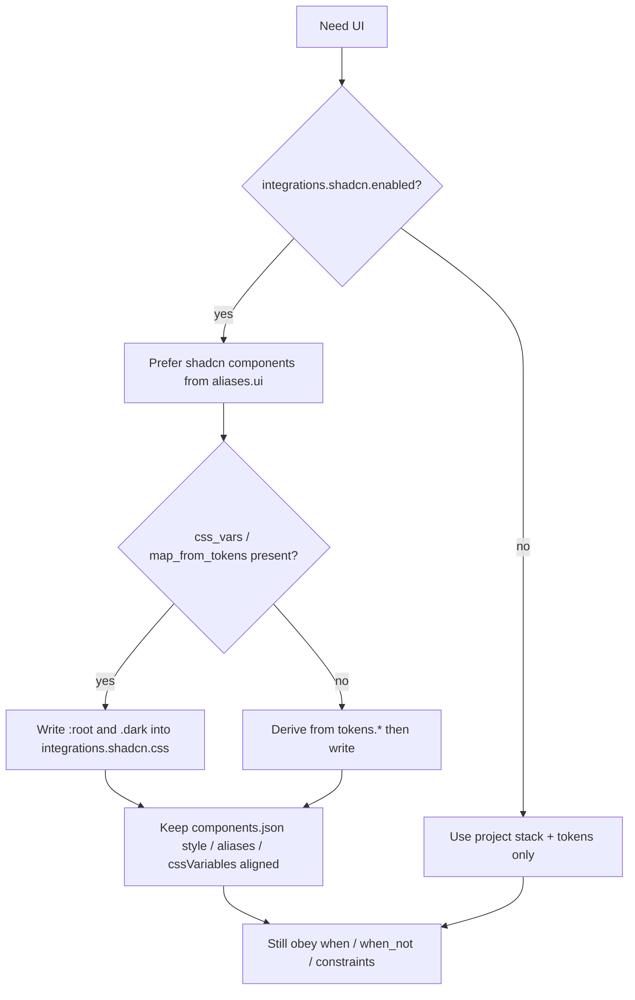

# shadcn/ui integration

`.design` does **not** replace [shadcn/ui](https://ui.shadcn.com/). It **orchestrates** it: tokens stay normative in YAML; agents write [theme CSS variables](https://ui.shadcn.com/docs/theming) into your global CSS and prefer installed shadcn components.

Official references:

- [ui.shadcn.com](https://ui.shadcn.com/)
- [Theming](https://ui.shadcn.com/docs/theming)
- [components.json](https://ui.shadcn.com/docs/components-json)
- [CLI](https://ui.shadcn.com/docs/cli)

## Why integrate

| Without `.design` | With `integrations.shadcn` |
| --- | --- |
| Agents invent one-off Button styles | Prefer `@/components/ui/*` |
| Theme drifts across chats | CSS vars regenerated from contract |
| `components.json` and brand diverge | Style / aliases / radius kept in sync |
| Hex scattered in JSX | Semantic `bg-primary`, `text-muted-foreground` |

## Artifact roles



| Artifact | Role |
| --- | --- |
| `.design` `tokens` | Normative brand values |
| `.design` `integrations.shadcn` | Mapping + CLI-aligned config |
| `components.json` | Install style, RSC, aliases, registries |
| `globals.css` | Concrete `--*` theme tokens |
| DTCG `tokens.json` (optional) | Export for other tools — not required |

## Schema shape

```yaml
integrations:
  shadcn:
    enabled: true
    style: new-york              # components.json "style"
    css_variables: true          # MUST be true for token-driven theming
    base_color: neutral          # init baseColor; brand comes from css_vars
    css: app/globals.css
    components_json: ./components.json
    rsc: true
    tsx: true
    aliases:
      components: "@/components"
      utils: "@/lib/utils"
      ui: "@/components/ui"
    radius: "0.5rem"             # → --radius (base of radius scale)
    css_vars:
      light:
        background: "#ffffff"
        foreground: "#0a0a0a"
        primary: "#0a0a0a"
        primary-foreground: "#fafafa"
        secondary: "#f4f4f5"
        secondary-foreground: "#0a0a0a"
        muted: "#f4f4f5"
        muted-foreground: "#71717a"
        accent: "#f4f4f5"
        accent-foreground: "#0a0a0a"
        destructive: "#dc2626"
        border: "#e4e4e7"
        input: "#e4e4e7"
        ring: "#0a0a0a"
        card: "#ffffff"
        card-foreground: "#0a0a0a"
        popover: "#ffffff"
        popover-foreground: "#0a0a0a"
      dark:
        background: "#0a0a0a"
        foreground: "#fafafa"
        # …same keys
    map_from_tokens:
      background: tokens.color.canvas
      foreground: tokens.color.ink
      primary: tokens.color.primary
      primary-foreground: tokens.color.on-primary
      border: tokens.color.hairline
      ring: tokens.color.primary
```

Normative field docs: [SPEC.md §7.1](../SPEC.md).

## Semantic token convention (shadcn)

shadcn uses **background / foreground pairs**. The base token paints the surface; `*-foreground` paints content on that surface.

| CSS variable | Typical use |
| --- | --- |
| `--background` / `--foreground` | Page shell, default text |
| `--card` / `--card-foreground` | Elevated panels |
| `--popover` / `--popover-foreground` | Menus, overlays |
| `--primary` / `--primary-foreground` | Primary Button, strong accents |
| `--secondary` / `--secondary-foreground` | Secondary actions |
| `--muted` / `--muted-foreground` | Helper text, subtle surfaces |
| `--accent` / `--accent-foreground` | Hover / selected chrome |
| `--destructive` | Danger actions |
| `--border`, `--input`, `--ring` | Borders, fields, focus |
| `--radius` | Base corner; derived `radius-sm`…`radius-4xl` |

Optional chart / sidebar tokens may be added under `css_vars` when the product uses those components.

## Agent workflow



### MUST

1. Prefer installing/using shadcn components instead of inventing parallel primitives when `enabled: true`.
2. Set / keep `tailwind.cssVariables: true` in `components.json`.
3. Write theme values into the CSS file at `integrations.shadcn.css`.
4. Treat `tokens.*` as winning over stale `css_vars` literals — refresh CSS after token edits.
5. Respect `components.*` `when` / `when_not` even for shadcn-backed controls.

### MUST NOT

1. Force a new styling stack if the repo is not on Tailwind/shadcn.
2. Scatter hardcoded hex in JSX when a CSS variable / token exists.
3. Silently overwrite `locked` token paths.

## Mapping from getdesign-style tokens

Examples in this repo map brand tokens roughly as:

| Brand token | shadcn var |
| --- | --- |
| `canvas` / `surface` / `background` | `background` |
| `ink` / `text` / `foreground` | `foreground` |
| `primary` | `primary` |
| `on-primary` | `primary-foreground` |
| `hairline` / `border` | `border`, `input` |
| `mute` / muted text | `muted-foreground` |
| `error` / danger | `destructive` |
| `tokens.radius.*` mid step | `radius` |

Exact mappings live in each example’s `integrations.shadcn.map_from_tokens`.

## Init checklist (new app)

1. Copy an example → `.design` and adapt brand copy/tokens.
2. `npx shadcn@latest init` with `cssVariables: true`, matching `style` / `base_color` / aliases.
3. Ask agent: *“Apply integrations.shadcn.css_vars to globals.css from .design.”*
4. `npx shadcn@latest add button card input …` as needed.
5. Build UI citing tokens + shadcn components used.

## Example files with shadcn blocks

All [examples/](../examples/) include `integrations.shadcn` (Vercel, Stripe, Notion, Apple, Linear, Supabase).

## Conflict resolution

```text
tokens.color.primary ≠ css_vars.light.primary
→ tokens win
→ update css_vars + globals.css
→ note the sync in the PR / summary
```
