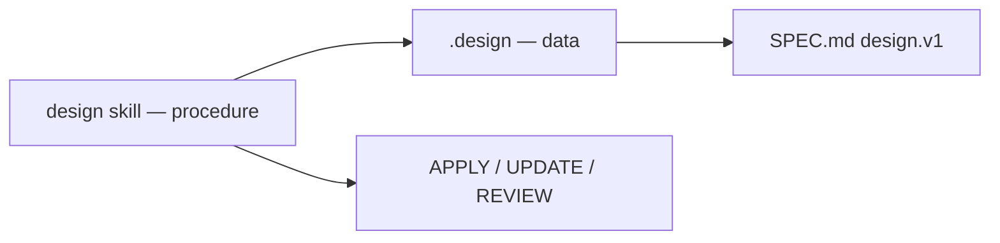

# skills.sh packaging

The `design` skill follows the [Agent Skills](https://agentskills.io/) / [skills.sh](https://www.skills.sh/) layout so any compatible agent can install one procedure for `.design` files.

## Layout

```
skills/design/
  SKILL.md                 # Frontmatter + READ→FOLLOW→UPDATE→VERIFY
  README.md
  examples/minimal.design  # Tiny valid stub
  references/
    APPLY.md               # Decision trees
    CRAFT.md               # Design-engineering bar when contract is silent
    UPDATE.md
    REVIEW.md              # Critique triage (ui-review style)
    SPEC-SUMMARY.md
    ATTRIBUTION.md         # Craft source credits
```

## Install

```bash
npx skills add AgentsORG/DESIGN --skill design
```

Or copy the folder to `.agents/skills/design/` (or your agent’s skills path).

## Triggers

The skill activates on UI generation, restyle, design drift, bootstrap, verify, shadcn theme work, and when a `.design` file is present. See `description` frontmatter in [SKILL.md](../skills/design/SKILL.md).

## Relationship to the format



The skill never invents a parallel token graph. SPEC + schema are normative; the skill is the portable procedure.

## Publishing notes

- Keep `metadata.spec: design.v1` in sync with the repo.  
- When procedure changes, update `references/` and examples.  
- Do not embed the full SPEC in SKILL.md — link out.  
